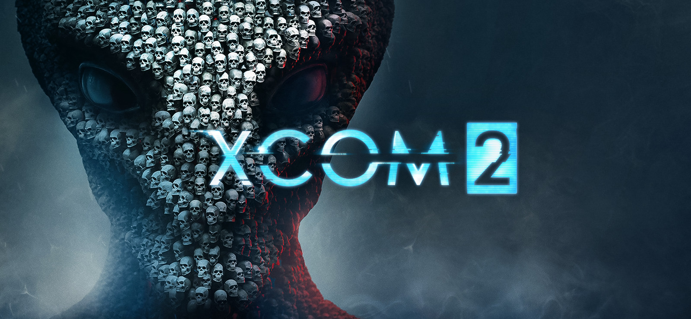
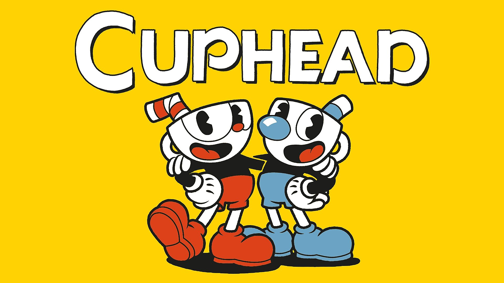
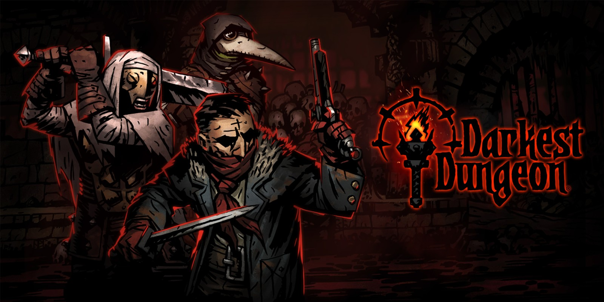

# 一、目录
由于Notion原页面中采用的是Table of content功能，在文章开头创建一个目录，如果不使用第三方插件的话是无法实现侧边栏目录的功能的。好在这个博客模板足够强大，在网页全屏情况下具有固定在页面右侧的目录，可以随时跳转到所要查看的block。感叹一声不用自己编辑真是太方便了！

# 二、全局总结

- 今年玩过47款单机游戏，其中7个游戏没有传统意义上的通关概念，剩余通关17个，放弃19个，还有4个在玩（暂不计入）。通关率47.2%，放弃率52.8%。
- 总游戏时长约2000小时，比去年增长约150%。
- 7分及以上优秀游戏21个，其中10分游戏3个（14.3%），9分游戏3个（14.3%），8分游戏5个（23.8%），7分游戏10个（47.6%）。
- 玩的游戏类型很杂乱： Card (15.2%) | ARPG (10.9%) | CRPG (23.9%) | Survivor (12.8%) 。2021年的游戏心愿是再少玩点Roguelike和Action（因为实在是太容易上瘾啦！），下棋也尽量少点，要多玩文字游戏。
- 总共记录十一个游戏，设置三个年度最佳奖，两个意外惊喜奖，三个EA鼓励奖，再设置几个花里胡哨的自嗨奖项：Chungou的快乐彩虹糖奖、Chungou的怀旧大冒险奖、Chungou的痛苦小皮鞭奖。

# 三、颁奖典礼

## **年度最佳 （共2100字）**

### **METAL GEAR SOLID V: THE PHANTOM PAIN**

:point_right: **[Notion Portal](https://www.notion.so/METAL-GEAR-SOLID-V-THE-PHANTOM-PAIN-2294ccfb79ee4f1d91f0cb257947a2d7)**

★★★★★

> -&nbsp;What if she's a spy? - What if I'm a spy?

遇到这个游戏真的是本年度惊喜，也算是某种必然吧。年中的时候和好友连麦同时各自在玩*Fallout 4*，他提到准备在展示课上介绍合金装备的叙述手法（大概是所谓的电影化叙事，虽然我完全不care），顺便和不太行的辐射4进行对比。而且之前一直有豆瓣友邻对这个游戏赞誉有加，再加上由于本人十一月份玩了太久的战棋，导致十二月中旬有点想换换口味，遂在年关将近，用半个月时间体验了一下。写下这篇总结前大约打了65h，Chapter 2 推到一半，全局45%完成度，是要接下去继续玩到通关的游戏之一。

虽然前面的七八部合金装备系列作品我一部都没玩过，甚至连相当于本作前身的Ground Zero我也没玩过，但是都不妨碍全身心沉浸在幻痛的世界中。虽然刚开始主线有点摸不着头脑，让我误判这是个讲述阿富汗战争老兵PTSD发作的故事，然而其实一切都是真实发生的，游戏主题是espionage，主打潜行暗杀和基地建设。对我来说这个游戏最大的闪光点其实并不是潜行玩法或者系列作品第一次实现的开放世界，也不是Kojima引以为傲的游戏电影化和主线剧情（虽然看到第一章结尾致意世界上消逝了很多种语言，还是有点感动的），而是家园系统。用一个面板就能解决crafting, deployment, personnel, building...诸如此类的战斗之外的操作，深得less is more简约哲学之精髓。Fallout 4和古剑奇谭这种家园系统冗余的典型如果能学到一星半点，游戏体验会改善许多。

至于关卡设计，算是第二个让我极度满意的部分。（剧透警告⚠️SPOILER WARNING）

拯救Miller被Skulls追逐重开了足足三次，然后是和Quiet对狙最后成功把她扛上贼船（Extream模式是真的难，呜呜呜），后来在非洲遇到娃娃兵并且收服他们的头领White Manba（好像和Snake有某种渊源），又在一个溪谷与四个寄生虫女狙击手对狙，再后来大战Skullface的暴走大机器人...
    

一般的任务通常是既可以选择无脑突入，也可以每个哨卡都暗杀潜行（我最喜欢的抓奴隶玩法...因为勒晕了敌军士兵可以送到自己基地做苦力，哈哈），当然也可以暗杀一半正面突入一半。上面提到的boss战则各有特色，不仅宏大场面和室内小空间并存，而且玩法多元，追逐、躲藏、肉搏、对狙、重武器轰炸应有尽有。每一场冒险虽然没有日式RPG那种和伙伴一起打败魔王的幸福感、归属感，但是作为孤胆英雄，七进七出，拯救世界（和新老部下），收获的大概是一种不一样的...自信？

### **Divinity: Original Sin II**

:point_right: **[Notion Portal](https://www.notion.so/Divinity-Original-Sin-II-83d9e07cab694dc9aed698593f2f7202)**

★★★★★

说起来，这是第三次通关这个游戏了，因为今年和好友在无外部备份存档的情况下合作通关了最高难度honor mode，所以算是正式完结，大概游戏时长也会永久定格在320.6h上吧（实际上打了350h左右）。但是还是略有遗憾的，比如Lohse的所有剧情我从未体验过，这大概是唯一一位n周目从未带上船的伙伴了，而且她的最终剧情还特别棒，无缘听到她的歌声了，呜呜呜。

作为一个先玩了神界原罪一代两百小时后，再玩二代三百小时的合格玩家，我觉得这部作品实至名归，配得上本世纪目前为止最佳CRPG的称号（当然也有很大进步空间）。（剧透警告:warning:SPOILER WARNING）

和初代类似，这个游戏最好玩的部分也在前期，拥有极少资源的情况下享受合成的乐趣以及奇妙combo，达到以弱胜强的目的；然后是中期的黑井矿坑Gwydian Rince之战，和后期在阿克斯城打医生，反而是最终boss战相当无聊。不同的是，神界原罪一在经过了第一章解谜部分之后，从黑湾开始一直在走下坡路，而原罪二的解谜元素是围绕中期获得灵视能力而展开的，逃出欢乐堡只是开始，可玩性一路上升。

 
同样的，原罪二对我而言最强大的部分并非战斗系统，而是勾前连后的故事性，或者说一个优秀的剧本。当然，我一周目通关的时候觉得这游戏精髓是战斗，到二周目能用独狼单刷tactic mode就觉得数值系统和装备系统有缺陷了，三周目发现一名角色脱离战斗后再加入，如此循环可以永远不到对手回合的操作后就觉得相当无趣了。抛开破坏回合制基本规则的漏洞不谈，神界原罪二的数值增长更接近乘法而不是传统战棋的加法，局内一刀999和局外为了换一件粉装斟酌半天，这两种矛盾状态确实可能同时存在。这应该有制作组为了加快游戏节奏、摒弃传统战棋战斗拖沓的考虑在内，但这也恰恰是我最不喜欢的“通胀式数值设计”。而游戏的故事打完三遍却仍然不丧失吸引力，首先每个队员都有自己的独特背景故事和剧情走向，其次是选择（或者不选择）学习秘源可以完成不同导师的任务，最后是选择不同结局（甚至可以队友祭天），每一种不同的分支都是一次不同的游戏体验，每一本小册子上的信息都会常读常新。
 

也正因为剧情的紧密相连以及次文本(subtext)的丰富，本作几乎没有初代那种为战斗而战斗的缺陷。（小剧透） 

比如初代一开始我就不知道为什么要打灯塔食尸鬼、火焰双子之类的boss，直到完成布拉克斯之战我好像才明白过来因为他的复活，这群小弟好像给人类带来了麻烦...而二代就算是突兀如野外逛街遇到女巫爱丽丝那样的战斗，也会有奶牛任务和其他文本做足铺垫（前提是按顺序进行）。

 
比较不满意的是二代合成系统，看似海量的小物件实则只能用在合成不同卷轴上，反而不如一代可以进行附魔和宝石镶嵌（暂且算镶嵌吧），自制最强武器等等。当然，这也是和系统简化不无关系的，砍去了手艺人这一辅助性加点路径本来就是一种官方的直接限制，使得二代的合成更多的是创造卷轴和道具为战斗消耗使用。

虽然总体来说，神界原罪一算是不错的游戏，但是原罪二能在它的基础上全方位更进一大截，就相当值得钦佩了。满分推荐！

### **Disco Elysium**

:point_right: **[Notion Portal](https://www.notion.so/Disco-Elysium-71b323d7d5b94b84878daf9d77e7848a)**

★★★★★

都2022了还不快去把结局通了！不写了！生气气！

## **意外惊喜 （共1700字，另有折叠评论1700字）**

### **Phoenix Point**

:point_right: **[Notion Portal](https://www.notion.so/Phoenix-Point-f60a0bc139794cba91319a650dc4b273)**

★★★★

> Sometimes the end has to justify the means.
> 

因为是连续十几天高强度通关的，所以打完趁着余热写了评论，紧接着又玩了XCOM: Chimera Squad（这样也算是玩过三部XCOM系列的作品啦！）。这里就先贴一部分之前写的评论，之后再聊聊XCOM。

部分原始评论（包含大量复述型剧透:warning:SPOILER WARNING）

连续十二天平均每天七八个小时，磨完主线流程和绝大部分支线。dlc质量较差，特别是artifact，强行拖时间，基本上可以直接忽略。选择了走Phoenix Point 正统结局，利用古代人Antivirus 科技消灭Yuggothion Receptacle然后同时对现在的世界生态造成巨大损伤 (Sometimes the end has to justify the means.) 还有三个派系结局，Disciples of Anu 变异女教皇统治世界人类开始进化（Phoenix Point eventually faded into shadow.）、New Jericho 建立人类共同联盟、Synderion净化世界但是没有打败Yuggothian。总觉得不论走什么路，都是悲观主义基调，虽然有一丝丝的希望，总体上真是很伤感啊。  
游戏内的势力分布包括：1.Phoenix Point 作为上个世代人类遗留下来的自救计划/组织，是玩家操控的主要对象。 2. The Disciples of Anu 宗教团体，由不完全受外星人掌控的女教皇主导，倡导人类不断进化与新世界共存 3. New Jericho 军事力量最强的独裁势力，相当于保守的人类主义者，要消灭一切变异病毒 4. Synderion 实力最弱的环保主义两面派，派系内的两种声音在游戏早期就呈递给玩家选择，净化世界or融入世界 5. The Pure 赛博主义游击队，全员实现高度义体化，并且致力于把全人类向机械生命体的方向转变，由于首领讲话太嚣张自身又没什么实力，前期帮了几次后面被我灭掉了。6. The Forsaken 一些派系内分裂出来的小团体或者中立小势力，例如图中的日本女皇，还有新西兰刷出来过一个叫the Father 的Anu内部的教派领袖，扶持他们可以帮助破坏敌对势力的基地，虽然我只是为了好玩才做这些刷出来的中立任务的。。。
    

    
感觉这个游戏的势力和Fallout 4很像，The Disciples of Anu 就相当于The Institute，积极融入新时代，New Jericho 和 The Brotherhood of Steel如出一辙，而Synderion简直是白左Railroad的翻版。因为游戏类型不同而没有RPG的人物刻画和挖掘，比如说在PP里体验不到Paladin Danse般的剧情是很正常的一件事，但是对于派系间的尔虞我诈和更为深入的diplomacy本应当作为主要的局外内容，却表现得不尽如人意。除了接各种破坏基地的任务之外，仅有的体现各派系互相攻讦的手段就是在随机刷出来的黄标支线任务中。所有本应具有表现力的元素都被简化为两三个好感度浮动数值，而出发这一切的源头就是一个简单的accept键。
    

作为XCOM系列的精神续作，PP革新了战斗系统，在SLG大框架之下加入FPS作为命中概率的变量，而且由于游戏引擎的设定，多出了一部分可破坏的东西。相当耐人寻味的一种设定，举两个controversial的例子。一是在全身掩体后发动攻击时，通常情况下角色会在战斗结算射击时自动跨出一格射击（当然这也会触发overwatch），而且在瞄准界面显示的是跨出掩体后的视野，但是攻击斜对角的敌人，有时不会采用掩体外的攻击视野，哪怕在掩体后的视野是完全不可见的。二是用重装兵的Mount laser进行稳定输出时，由于射击过程中的时间流动，敌人躯体部位的起伏会导致弹道落空，同样的问题还会出现在监视延迟上，如果敌人在进入范围后、监视者射击前视野恰好被队友挡住，那么子弹会落到自己人身上。不过除开一些大大小小的bug，以救援基地，sabotage，和攻打三种Pandoran base为首的高度重复的战斗，加个augment就是一种新敌人的一贯操作，还有某些武器、兵种、载具的平衡性问题等等之外，战斗系统总体来说还是很不错的。前中期有七八人小团体作战，中后期可以操控多达二十个单位的基地守卫战，既有大场面也有piece of cake。比如第一次见到Scylla的硕大身躯以及得知之后要捕获一只这样的巨兽时，进行到游戏中后期沉寂已久的热情又被燃起来了。
    

    
最后是局外构筑和building一类的东西，还是具有一定策略性的。比如前期sniper+shotgun的配合，比如后期双职业heavy+sniper爆炸输出，再比如娱乐打法双职业stealth+berserker蜘蛛流。只不过这些人物构筑都是为了战斗而服务，再乐此不疲最终还是要回到重复千百遍的战场上去。相比之下，基地建设就简化得很休闲，总共将近二十种建筑，可以在全球各个设定好的位点建立多个基地，可以拥有最多八艘飞船在全球执行任务（所以任务节奏可以变得很紧）。我的通关存档总共建造了八个基地，四艘飞船，拥有四十多名兵员，后期几乎每隔几秒钟就要进行一次战斗（当然一大部分可以不打）。

**再梳理一下XCOM系列** 
**1994: X-COM: UFO Defense (UFO: Enemy Unknown)**

由Julian Gollop设计、MicroProse在DOS和Windows等平台上发行的初代XCOM原型体，虽然那个时候我还没有出生，但是以后要买盘考古也不是不行...虽说是初代，却已然是巅峰，不仅奠定了后世作品的玩法基调——造基地、造飞船、招兵买马、打外星人、发展科技等等，而且系统之复杂、规模之宏大、策略之多元，在那个年代是难以想象的，甚至可以令当今的几部续作汗颜。

局外构筑据说有复杂的加点和装备调度，局内战斗据说也有不同开火模式 (aiming, overwawtch, burst etc.) 和操作策略，特别是当小队人数达到一定规模后，会特别好玩（吧）。还有个2014年的游戏Xenonauts（由Goldhawk Interactive制作发行），打着重制版的旗号，但是看起来并不好玩。现在二代也处于EA当中，情况也不是很乐观。至于在新千年前后一大票顶着XCOM之名在Windows上发售的没什么影响力的作品就暂且忽略不计了。

**2012: XCOM: Enemy Unknown**

在沉寂了十多年之后，由Firaxis和2k接手的XCOM重新焕发生机，而使大多数新生代玩家熟知XCOM这一ip的就是这部作品，designer换成了Jake Solomon (XCOM‘s stepfather?)。他是XCOM的真爱粉，从2004年开始就有振兴这个游戏的想法，可惜做出来的东西自己都觉得是一坨...幸好有一帮靠谱的组员，于是从2007开始正式开发，并且随着Firaxis给的预算越来越多，XCOM：Enemy Unknown的本体终于在打磨了五年之后问世了（并且走上了dlc越出越多的路）。

**2016: XCOM2**

2012年的XCOM我是没有体验过的，正式入坑也是这一部作品。没有购买任何dlc，本体一共玩了30小时左右通关。和最早的UFO相比，新XCOM们不再支持复杂的角色养成与全球基地建设，而是选择性继承了找资源，修缮基地，发展科技，打外星人等核心玩法。其实有所扬弃是必要的，走上这条路的新XCOM将会逐渐脱胎换骨（主要还是有粉丝基础和庞大的预算）。

**2019: Phoenix Point**

XCOM之父Julian Gollop创立的Snapshot Games （致敬初代UFO！）终于接过火炬完成了这部作品，让XCOM找回了最初的感觉，所以某种意义上来说，这是部粉丝向游戏…PP不仅保留了绝大部分UFO的设定，而且基于Unity引擎发展出的第一人称射击模式（取代了XCOM饱受诟病的命中概率，虽然有些时候也让人很无语就是了...）和破坏掩体（相较于XCOM2的炸穿天花板，能破坏的更多，战术更丰富），一定程度上升华了整个游戏的战斗系统。当然，真的只是一定程度上，有三点天然劣势，不从根本上改变，这个系列就永远无法突破。一是回合制战棋这一游戏类型无法避免的节奏拖沓，二是XCOM一直以来大量重复的任务和关卡，三是毫无策略可言、只是数值比玩家强大的弱智一般的AI。虽然话说得有点狠，但是Phoenix Point还是值得一玩的，不过dlc和最高难度毫无意义，体验到Scylla出场其实就差不多了（个人经验）。

**2020: XCOM: Chimera Squad**

如果说利用新引擎、新技术不断扩大规模是XCOM系列游戏发展科技树的一个分支，那么与PP几乎是背道而驰，XCOM: CS 走上了另一个分支——缩小体量、集中功能。战斗只能上场四名角色，其他单位就在基地中操作养成系统；长战斗被划分为关卡式的段落，每一段以“突入”作为先手起点，在极小的空间中进行；战斗中单位轮次被分割开，几乎都是敌-我行动，不再存在以往的逐个击破模式；人物角色固定，且增加rpg元素，缩减了养成各个兵种单位所消耗的大量精力。

某种层面上来说，Chimera Squad是在进行自我突破，不过依我十多个小时的游戏体验来看这次转型略显怪异（真的很像Klei出品。。。）。过分强调小空间和小规模，就会导致很奇怪的结果，尤其是在理应展现宏大场面的boss战，十几个敌人挤在一个地下教堂的传送门边，团团围住只有四人的主角团，那个场景真的滑稽又令人无奈。游戏进行的流程确实快了不少，但是推完一个主线我并不感到快乐，而是很累，从很逼仄的空间中解放出来，我只想去开放世界逛一圈。我觉得一个真正好玩的游戏不应该是这样的，只能说有感觉到开发者们的努力，但是做的还不够好。

**To Be Continued: XCOM3**

如果三代还是不从根本上改变，而只做些细枝末节的修饰，未来也可想而知了(endless dlc wwwww)。但是如果XCOM3做成奇美拉小队的模式，那也还是算了吧。只能说奇美拉小队的方向是对的，却没那么有效，前面的路还挺长的，期待能玩到脱胎换骨的XCOM3。

### **Katana ZERO**

:point_right: **[Notion Portal](https://www.notion.so/Katana-ZERO-bcfa7cd3de46426cbf266d984987e649)**

★★★★

打个不恰当的比方，在Hades之后玩Katana ZERO，就好像在十五年前玩Cuphead一样（哈哈，一句话黑了三个游戏，虽然它们除了action基本上没什么共同点...）虽然说这个游戏玩法本质上是靠背板+肌肉记忆，但是核心却绝不是传统意义上的闯关。检验一个东西的重要性的最简单方法，就是把它去掉。倘若这个游戏没有选项、分支和对话，那么上限最多是个爽感十足的HCG。而只有经历了手眼协调的考验之后，再加上那么一点点的灵肉拷问，大概就是目前“优秀游戏”的不二法门了吧。

---

## **EA鼓励奖（共1700字）**

### **Griftlands**

:point_right: **[Notion Portal](https://www.notion.so/Griftlands-81368c4120f04822b66d81e37ae11671)**

★★★☆

**Last Played Version**: Update patch #17

**Recent Played**: Nov 27, 2020

**Sep 15, 2020**
这个游戏算是“把一种游戏类型做到极致”的教科书：经验与实力并存的制作团队（Klei），吸收了大量前人的经验（Slay the Spire的部分局内玩法和运行模式），以及推陈出新、融会贯通（回合制rpg并肩作战的队友，roguelike的随机事件，养成游戏的人物好感和剧情走向）。虽然每一种游戏类型都有各自天生的不足之处（当然它们也有各自的使命），在这个麻雀虽小五脏俱全的优秀作品中，我能够感受到制作组为了冲淡“刷”这一核心玩法而加入的剧情、对话、主角的背景故事等元素，也充分体验到以数值为核心的策略性与随机性的平衡，已经很令人满意了。

**Nov 27, 2020**
尝试了一下第三个人物之后，感觉新机制的创新还行，卡牌也很有趣。就是流程过短，应该是没做完，还有感觉原地结婚这个小结局确实匪夷所思，希望接下去的后半段剧情不要做得太奇怪。

### **Stoneshard**

:point_right: **[Notion Portal](https://www.notion.so/Stoneshard-630b9747c20b46b3af4cc604c9877608)**

★★★

**Last Played Version**: 0.5.9.5

**Recent Played:** Jul 13, 2020

惊艳的序章打完就剩下没有剧情、单纯接副本任务刷装备、等级和技能书的rpg日常，再加上不确定因素波动和硬核的只能睡一觉存一次档，经历过几次满载而归却在半夜小路上被gouls或者goons截杀然后前功尽弃，耐心就应该消耗得差不多了。从我七月份弃坑以来到写这篇总结为止，制作组就更新了诸如双手斧技能树之类细枝末节的东西。不过可以预见，将来的新副本、新职业套路、新剧情、新增的合成系统和强化后的烹饪、狩猎元素等等还是可以期待的，毕竟现在只做了一个古代巨魔boss就已经很激动人心了。

当然，这个游戏不乏闪光点，实际上作为一款相当复古的跨类型（rpg+roguelite+SLG）游戏，Stoneshard在很多方面已经算得上优秀了。举个例子，地图系统深得老游戏的真传。传统的rpg游戏地图的功能，除了指示方位、标明重要地点和显示地形以外，可以归结为“以主角为中心的任务指向型导航”。每驱散一片战争迷雾或者解锁一个传送点，大地图上都会实时更新，标注好重要npc和设施之类的。但是从前有个游戏叫做Gothic，它的地图是遵循“绘图师画出来的”这个原则，所以不仅不会实时显示主角位置，甚至在极度危险的区域直接是一片空白。对世界的认知随着探索而改变，地图真正成为了辅助工具而不是几秒钟查看一番的导航，于是这种极简被归结为“less is more”。（参考视频见下，点击图片即可跳转到相应的Youtube页面。）

依此为对照，Stoneshard的地图系统也是一脉相承，最危险的地方（比如巨魔领域或者盗贼巢穴、腐化修道院等）被标上问号，而城镇和郊区、一些新手副本则被画了出来，同时，主角的位置不会显示在地图上，只能依照自己的记忆和周边地貌判断自己大致在哪一图格。虽然一开始玩的时候，我这个超级大路痴一直破口大骂，尤其是满载而归却因为看不来地图回不到城镇导致半夜被截杀，但是被虐着虐着一股钦佩之情反而油然而生。我不断反问自己：如果Fallout的pip-boy出现在这个游戏，或者这个游戏的羊皮卷地图替代了废土世界的电子导航，难道会使两个游戏各自变得更好吗？显然，没有最好的，只有最合适的系统。而这个制作组在“让我们的游戏适配最合适的地图系统”和“让玩家有最舒适的地图体验”之间做出了他们的选择，respect！

### **Mount & Blade II: Bannerlord**

:point_right: **[Notion Portal](https://www.notion.so/chungou/Mount-Blade-II-Bannerlord-e7b031221c304f4fae534e99702efc21)**

**？？？（没在Game2020中标记诶，那就不放链接了）**

**Last Played Version**: e1.4.2 (e1.5.7 now available)

**Recent Played:** July 9, 2020

> "I WILL DRINK FROM YOUR SKULL!"
> 

为什么不放Baldur’s Gate III 而选择Mount & Blade II 呢？首先我没通关博德之门前面的作品，而且小说也只看到第十八章，而战团和各种mod却是实打实玩了几百小时的。其次是Larian Studio，放下D:OS3的日程仅用一年多就开启了BG3EA，这实力和执行力也没什么好鼓励的了；反观砍2，有人等了十来年（虽然我只等了四年），而且从17年开始Taleworld就一直在放更新补丁，光打雷不下雨，而现在终于可以体验了，虽然有诸多不尽如人意的地方，还是稍微鼓励一下吧！会玩的人自然会买，没玩过骑砍前几作的人也可以直接尝试（不过性价比略低啊...如果我不是“情怀”玩家，在我的愿望单里肯定排不上号），反正这类游戏后续的mod才是核心，本体就当支持原作者的副赠品了。。。

- 以下是简单的记录，没什么好评价的。加油开发得更好吧！（更新得也太勤快了，翻日志翻到我手软）
    
    **May 1, 2020**
    
    距离入手都过去快两个月啦，因为各种原因还是没动过一次，今天找了一个演示的视频看了一下，直感上ui系统是变化最大的，战斗大概只修饰了一下，战术系统、军队系统、npc队友之类的都没有很大的革新。至于攻城掠地、经营自己的领土、追求爱情之类的还没看到，等过段时间有空（大概要下半年啦～）再亲自体验一下吧。
    
    **July 9, 2020**
    
    因为懒得自己砍想玩智魅流，结果体验还行，因为骑行和弓箭一些设定都改了，所以操作还不适应，阴差阳错第一个档也就这样下去了。但是没有感受到之前宣发的时候说的政治系统有多么强大，就多了个家族和管理，和npc交互还是一如既往的简单无脑，希望之后能更丰富吧。
    
---

## **彩蛋三枚（共1300字，另有废话2400字）**

### **Chungou的痛苦小皮鞭 - Darkest Dungeon**
:point_right: **[Notion Portal](https://www.notion.so/Darkest-Dungeon-4a71e851e5bd496e8759c625f63a476b)**

★★★★☆

大部分游戏是从征服的快感、竞技的爽感和建造的成就感中获得乐趣的，但是有一类游戏通向快乐的路径是痛苦。虽然听起来很矛盾，但是对于有“特殊冒险精神”的勇者来说，尤其是像我这样最高难度开荒、不看任何攻略的纯受虐玩家，确实是一种享受...

它们的共同点大概是永久死亡、几乎不能SL、氛围极其黯淡、学习曲线平滑（基础上手门槛高、进阶困难等）、有着自己独特的叙述美学。然而由痛苦导向快乐的前提是，你在玩的是一个优秀的游戏作品。如果质量没有达标，那种空有痛苦的感觉应该是没有玩家希望体验到的。鉴于黑暗地牢也不是什么新游戏了，脱离EA后也就是打补丁、调平衡、出dlc之类的完善操作，其实雏形在16年就已经形成了，各路评论也已经很多了，于是乎就在最后贴几个有着类似哲学属性的作品好了...

&ensp;&ensp;
 
&ensp;&ensp;
 

世界上最痛苦的RPG，不看攻略不开辅助，据记载世界上只有三个人通关。不好意思，前面几个游戏的痛苦程度加在一起也没有Wizardry IV前三层来得多。这是每个自诩游戏精英的玩家都应该尝试的作品，不管是在第几分钟放弃，它都会作为里程碑载入你的私人游戏史，标志着你对游戏的痛苦哲学有了无上的切身体会：痛苦只是手段，而不是目的。

最后插一句，Darkest Dungeon里面的角色在stress bar变满之后会经历一场考验，绝大多数成为了traumatized troublemaker，少数由于具备特定quirk (可以看作是天赋秉性）或是佩带了trinket (可以看作是寄托了信念的护身符）或是单纯挺过了至暗时刻而成为“the Enlightened”，在队伍中发挥至关重要的作用。其实生活就是黑暗地牢，如果你现在正在像Chungou一样经历着考验，或者正在更加阴暗的副本中劈荆斩棘... Pathfinder, let's sit around the bonfire and inquiry - post-traumatic growth or post-traumatic stress disorder, which way?

### **Chungou的怀旧大冒险 - 仙劍奇俠傳**

:point_right: **[Notion Portal](https://www.notion.so/The-Legend-of-Sword-and-Fairy-Chinese-Paladin-4598847c5c1d47428af26de382ae0228)**

★★★★☆

> 魔非魔、道非道，善惡在人心。
> 欲非欲、情非情，姻緣由天定。

 

撇开年代造就的技术限制和所谓的情怀加持不谈，仙一乍见之下，有种源头活水般的清爽；久处之后，留住我的反而是诚意——老游戏普遍具有的一种品质。不过弱点也很明显，冗余的迷宫设计（十一层的女娲遗迹是我这种路痴宝藏猎人的痛...）以及完全鸡肋的道具系统等等。但是现在的玩家不会真正在乎扔出一把淘汰的武器能打多少伤害，酒神这个技能的实用性到底如何，或者某个迷宫的角落隐藏着什么小道具，顶多关心下某个角色能不能推倒罢了。而这正是RPG堕落的一种表现，从玩游戏的人和他们玩的游戏，到做游戏的人和他们做的游戏...所以我这样的年轻人玩老游戏，特别是一些在我出生前就问世的老游戏，是为了什么呢？唯尽兴耳，不足为外人道。

### **Chungou的快乐彩虹糖 - Fae Tactic**

:point_right: **[Notion Portal](https://www.notion.so/Fae-Tactics-48704040ce6547dba60d8ac6dc1286e5)**

★★★

这个游戏远远称不上算是一个优秀作品，最多只有合格，而且我也不推荐任何人去玩，尽管我花了五十个小时清掉几乎所有支线、打出了3A4B的人物结局。但是这个游戏对我来说仍然像是彩虹糖，让我重新体会到最初玩游戏，特别是玩indie RPG的感受，那是童年的味道。这将是一段非常私人化的闲言碎语。

以下是一大堆回忆最早玩游戏的废话

    
大概一岁开始被大人抱着玩传奇，三岁开始的娱乐活动除了在社区乱跑几乎就是在电视上玩坦克大战和魂斗罗（大概是因为年龄比较小，没有经历过卡带游戏机的年代，当时用的是DVD读光盘，后来长大了就是PC），六岁混迹于游戏厅看叔叔们玩恐龙快打和吞食天地。但是影响我最深的是大概九岁，读小学三年级时遇到的记忆中第一款indie game，是用当年的RPG Maker XP制作的，叫做笑谈学校。作者是个看起来很油腻的胖...叔叔，自建妞妞工作室，成员就是他自己和一条叫做妞妞的狗。由于贴吧网名叫Panda，以自己为原型的游戏男主叫潘萌，故作者被称为潘大。其实潘大应该是C9毕业的高材生，制作笑谈学校的时候已经工作了一段时间，而且结婚了，当时正在准备考研。但是他总是戏称自己为烧锅炉的，年幼无知的我因为很相信在讨论游戏时一本正经的他，所以真的觉得他是烧锅炉的...长达十年之久🙈。
    
这种错信给幼小的我造成了一种微妙的影响，觉得每天用烧锅炉的空闲时间制作游戏的潘大好伟大，他虽然只是一个文化水平特别低的人，但是却努力完成了自己做游戏的梦想，还给我们带来快乐，我以后也要制作最好玩的RPG。随着笑谈学校脱离由众网友合力完成的b测，潘大终于在打完无数个补丁后实现了最初的梦想，我也由小学升入初中。然后潘大在贴吧上开始宣布制作第二个游戏，重生学校。游戏主体仍然是当年的味道，只是拥有更多经验和能力的潘大带来的游戏体验却是翻天覆地，最初的梦想重生了！这次我有幸玩到了测试版，可惜由于读的是几乎全日制的私立中学，基本上没什么时间玩。而且初二第一次接触DotA，除了在与世隔绝的岛上会玩单机游戏，平时更多的是和小伙伴们一起打DotA。
    
不久后噩耗传来——潘大宣布重生学校将是他的最后一个游戏，因为没人玩了，他也没有动力继续做第三代了，当然也有生活上的考虑，家庭不再允许他执着于这些属于过去时空的毫不盈利的琐事上了。重生学校正式在一些游戏论坛上发布的那段时间，我的windows XP系统的笔记本上还留着那个测试版，在梦境的开端，打开第一个宝箱，里面有一个问号图标的随时存档道具。我一直没有下载正式版，直到读本科一年级的第二个月中旬。
    
潘大曾说自己做的游戏完全免费，自己的初心本来就不是用于盈利，而是实现自己的梦想。但是像所有制作者一样，他也会把凝聚了自己心血的作品看得很珍贵，不希望玩家肆意修改数据，更不希望有人把魔改版的游戏（所谓的Fans Content）发到论坛上娱乐。他的一些做法深深影响了从知识产权荒漠中成长起来的我，当然，这些算是后话了。

 
所以说当看到这个小制作组在自己网站上发声明说感谢大家支持，现在正在和外面的组合作移植到console上（因为技术原因自己搞不定），我就觉得他们好困窘好贫乏，就算做出了这么一个并不算好玩而且缺点很多的游戏，但是却当作自己的宝贝，这种精神让我瞬间感动，并且让我回想起上次类似的感动是感受到潘大吐槽bug太多自己写脚本能力又跟不上，承诺会尽快打新版本补丁时喜忧参半的语气。所以好不好玩什么的都无所谓了，我只打了五十个小时，而背后的他们却为了给我带来快乐而呕心沥血了五千个小时。感谢五十多个小时的陪伴，Peony和Endlessfluff Games的大家，江湖有缘再会啦！
  

最后贴一下已经完全不重要的评论（大量剧透警告:warning:SPOILER WARNING）

50h+ 和通关存档计时42h比起来发现竟然有8h是战斗读档时间，侧面反应SLG战棋是有多么拖节奏。没刻意刷过，主线支线全清，界面上可见的任务和故事全完成，队友结局竟然还有四个B (Peony - A the girl who saved the world, Pichon - B, Chico - B, Orowantus - B, Erisolde - B, Payachin - A, Tom Tildrum - A)
    

    
游戏主线可以理解为female protagonist+日式rpg冒险找伙伴+牺牲与救赎的英雄主义式结局。虽然放到更大的游戏范畴中怎么看都是低幼cliche，但是受众年龄再小一点就相当合适：首先女主Peony的形象无论对男孩子还是女孩子都很有教育意义，其次写故事的的人不是在说教，是在娓娓道来，第三大概只有童心未泯才能一直玩下去（或者和我一样无聊+真的很喜欢Peony）。何况还能要求Endlessfluff这种移植到console上都要和别人合作而且还由于技术性问题一直没完成的小独立制作组更多东西吗？Fae的IP建立在自己11年的一款三消回合制战斗casual game的基础上，新增女主角Peony的人物原画已经相当不错（简直就像梦回十五岁在日内瓦湖畔邂逅彼时还扎着马尾的青涩Beatrice）。光是这样觉得似乎还说得过去，但是对话的时候看立绘顶多只花几个小时，游戏内各种系统却是实实在在体验了几十小时的。
    

    
在战棋这种游戏类型的局限性已经相当大的情况下，这款游戏的各项系统也没有特别丰富，也会采用改个颜色就是新的敌人/召唤兽的省钱操作，几场反人类战斗还特别喜欢开局设置很多转移伤害的元素水晶强行拖时间。合成、加点、烹饪（翻卡小游戏，作为战前buff）之类的没什么好说的，重点谈一下战斗系统，综合看来这个游戏的战斗设计水准是配不上人物原画和剧本的。首先过度依赖于数值而轻视游戏性，使得战斗更像是在制作组编好的数学算法规则内下棋，而不是在玩战术多样、内容丰富、节奏起伏的战棋类游戏——绝大部分输出都来自于普通攻击和强化普通攻击，采用概率命中和地形/位置固定比例加成，移动无碰撞体积和惩罚。因此基本上所有战斗采用一个思路，死磕数值磨到十几回合都能致胜，那就是防御策略用buff提高全员血线增加容错率，进攻策略用减护甲围殴boss三五回合即可致死。没有技能和主动道具，异常状态在属性克制创造的数值差距鸿沟面前可以直接忽略，这直接导致至少三十小时的战斗流程非常单调重复。
    
而且制作组大概是知道自己的短板，所以很鸡贼地采取了拖时间和人为增加不必要的难度的策略。这里着重批评游戏中后期的战斗，比如雪山支线打Wendigo，受伤瞬移+元素水晶+不断刷小怪，至少要打一小时，还不包括第一次接触不熟悉它的特性摸索的时间。过关之后仅仅是通关时多个额外结局显示Claudia把研究数据带回去之后科学家们致力于拯救可能被困在另一个世界的人们。还有保护Prince Mercury的战斗，由于设定是npc每回合受伤，主战场Ikaido Summit是火系，制作组的目的明显是让玩家使用都是奶妈+防御型的counter属性水系tailsman，而开局又有六个火元素水晶吸收伤害，基本上尝试一次也要半个小时左右。
    
最后是boss战，中规中矩的二段变身，加上算是整个游戏内相对较大的场面（除了在Dark Pool杀一个克苏鲁boss的场景和贴图可能比最终战更唬人以外），再加上战斗前后嘴炮交代剧情揭露身世，只能说有尽力营造高潮，但是很可惜，一点也不激动人心。直到结局画面一个接一个浮现，滚动条开始送走许许多多的名字，我才确定这个游戏真的戛然而止了。只能说真是太可惜啦！

---

# 四、结束语

其实严格意义上来说，我写的基本上都不算游戏评论，而是复述自己的游戏过程和体验，从主观感受出发，评判这些作品。所以总的来说用语比较随意，而且很喜欢用括号补充说明（因为感觉像是在和人聊天，括号里的就是我的内心活动啊！）。这篇东西大概既不是评论也不是推荐，而是总结和回顾我在2020玩游戏的体验和心路历程。更私人化的是，之前在开头写了给自己的一段话，但是因为太羞耻所以还是删掉了www。那就在结尾简短地许个愿吧：想在2021年和以后的日子变得更好，玩更多的好游戏，遇到更多的好人，弥补自身更多的缺陷，然后在未来某一天如果有机会的话，要像前辈们一样制作出属于自己的好游戏哦！Chungou加油！