<!-- **BGM: Cosmic Accelerator - エレクトリックな４つ打ちダンスミュージックです。テーマは宇宙の旅。**

--- -->

## **游戏总结**

- 2021年大大小小的游戏玩了有75个，新游戏、老游戏都有，但是新出的游戏不多；大游戏、小游戏也都有，但是以小游戏居多。总计打通28个游戏，排除8个没有传统意义通关概念的游戏，通关率为41.8%，相较去年略有下降，但是差别不大。
- 记录总计游戏时间约813h，比2020年（2000h，其实这个2000h有很多水分在里面，很多是前几年的游戏时间累计而成的）下降约150%，应该为不完全统计，仅供参考。
- 7分以上的优秀游戏总计36个，其中10分游戏1个（2.8%），9分游戏4个（11.1%），8分游戏12个（33.3%），7分游戏19个（52.8%）。相较去年虽然总数有所上升，但是头部高分游戏数量有所下降。
- 游戏类型Roguelike (20.0%) | Survive (13.3%) | RPG (13.3%) | PuzzleSolving (10.7%) 。相较去年丰富度略有提升，但是依然有很大局限性，比如FPS、文字游戏、音游等等都一个也没玩。
- 此次游戏总结提及，分为三个板块：Best of the Year, Indie Banquet, Mobile Jotting，有私赏也有不满，都写在一起吧，不像去年那样设置各种花里胡哨的奖项了。

---

## **详细内容**

### **Best of the Year**

由于今年一部所谓的3A大作也没有玩，一直在玩符合自己胃口的独立游戏或者genre，所以相比起去年的年度最佳略显寒碜（虽然每年都很寒碜，但是今年更甚一筹hhh）。而且有凑数之嫌，其实让我心悦诚服的最佳只有PF:KM这一个，无奈玩得太少但是面子上又想做得好看，所以就只能东拼西凑啦~选了五个游戏作为年度最佳，依据喜好排序如下。

### **Pathfinder: Kingmaker**

:point_right: **[Notion Portal](https://www.notion.so/Pathfinder-Kingmaker-3a18ae0fd8bc45efb751a90a623e451b)**

★★★★★

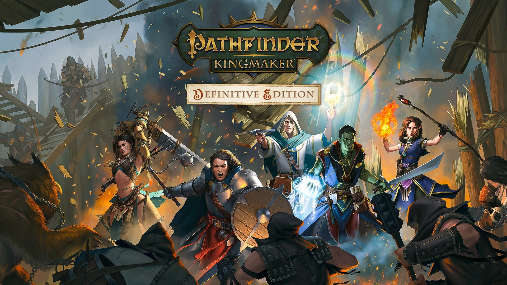

这个在2022年还没通关，在打了在打了… 通关了就来补。

---

### **Inscryption**
:point_right: **[Notion Portal](https://www.notion.so/Inscryption-940b90d670364082a9445b702baf9a6c)**

★★★★☆

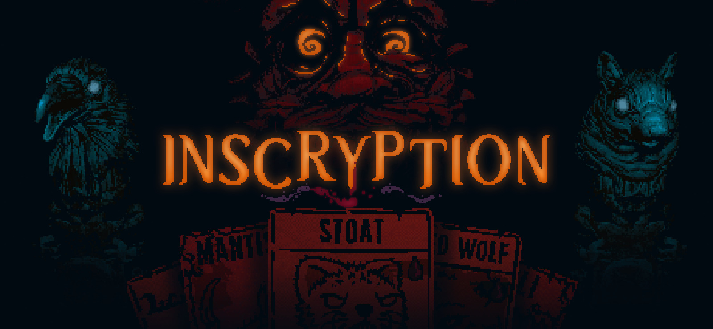

时隔很久再回归头来看这个游戏，我觉得它胜在（游戏制作的）策略而非创新，因为单论idea，独立游戏的宝库中不乏比Inscryption更为耀眼的存在，但是能完整实现的却少之又少。听过好几个讨论此游戏的播客节目，大多是对第一章赞不绝口的。这就好比是写文章，立意开门见山，用最多的笔墨和心思妆点全文最突显的部分，那么读者一旦拥有了眼前一亮的第一印象，自然会耐着性子品完剩余的部分。其次是meta的噱头，只能用锦上添花来形容，若是采用传统的关卡设计依然是个好游戏，但是沿用前两部作品的设定，既对粉丝友好，又能提高路人中的话题性。其实相比起略显呆气的天才Jonathan Blow，可能Daniel Mullins才是大多数独立游戏开发者想要获得认可应该选择的榜样吧。

---

### **Battle Brothers**
:point_right: **[Notion Portal](https://www.notion.so/Battle-Brothers-67afbf68bba94e5e850e82b5ba84b73b)**

★★★★☆

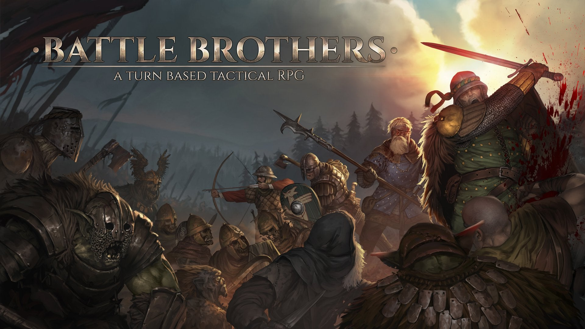

> **我有上将潘凤，可斩华雄！** **吾观颜良，如插标卖首尔。**

难以穷尽我对这款热血战棋的溢美之词，几乎弥补了我在年少时期的每个无眠深夜欠下的酣梦。试问有哪个被奇幻传说浇灌长大的孩子会不喜欢在中土世界般诡谲莫测的大陆上展开的佣兵冒险故事呢？这么说不太准确，因为游戏机制淡化了故事性而增强了随机性，把选择权更多地交付在玩家手中，所以应该把视角从“倾听故事的顽童”转变成“创造史诗的英雄”——有哪个孩子不喜欢体验亲自在中土世界运筹帷幄、统帅三军、功成名就、称霸一方的感觉呢？（此处自动忽略骑砍玩家。。）

 贴一下部分原始评论，包括一些复述和幻想。

可以把这个游戏概括为“精简战棋版骑马与砍杀”，玩下来觉得本体和野兽附带内容质量都挺高的。本体的养成和战斗在战棋中算是非常硬核，永久死亡机制（这点其实还好，非ironman模式都可以回档）与经济系统（主要是决定发育速度）以及高自由度开放式大地图，竞技场和Northern Warrior的dlc等等元素都太像Mount and Blade以及各种mod了。奇幻元素的适当加入使得游戏在中后期的可玩性大幅上升，比如与哥布林和兽人的战斗、比如不死军团、比如巨魔（长得像troll但是名字叫Unhold），这比单纯的人族之间的战争要刺激多了。我睡前甚至还设想过，Greenskin家族还可以有Ogre, Goblin Ogre Rider(既然都有Wolf Rider为什么不可以有像植物大战僵尸里面的巨人僵尸上面骑个小鬼的设定www)等，可以加入占四个格子甚至七个格子的龙、象、鼋之类的野兽（不知道Kraken是不是这样，还没打到），人类可以有Mage的职业并且加入巫术与卷轴...然后想着想着就像少年时的许多个夜晚一样睡着了！所以说像骑砍一样开发mod肯定相当有拓展空间，但是也许现在这种半满的状态才是这个游戏最迷人的样子吧，谁知道呢？
    
不过之所以说这游戏像是精简版骑砍，还有一个原因在于，主角“我”不像是传统rpg一样是作为参战人员投射到游戏中的，而是以幕后管理人的身份经营着battle brothers雇佣军团队，且一辈子都只能是雇佣军，不会像骑砍那样出现自立为王、攻城略地、经营城镇的局面。可能这一点对于类型游戏重度痴迷玩家来说是个遗憾，格局不够宏大。战斗与任务较为重复，按照平均下来天数与战斗次数2:1的比率来算的话，没有加速与跳过(strategy mode)的选项，哪怕实力悬殊每一场也都要完整打完。还存在一些小bug，比如地形高低会显示图格黑块影响决策、进入城镇UI界面偶尔会不显示必须小退重进等等。不过总的来说，真的是一个不可多得的好游戏。

---

### **Hollow Knight & Ori and the Will of the Wisps**

:point_right: **Notion Portal: [Hollow Knight](https://www.notion.so/Hollow-Knight-f779000133544b7da362544d65789214) & [Ori and the Will of the Wisps](https://www.notion.so/Ori-and-the-Will-of-the-Wisps-13b1bd5f393e460a9f98720c7de35833)**

★★★★☆

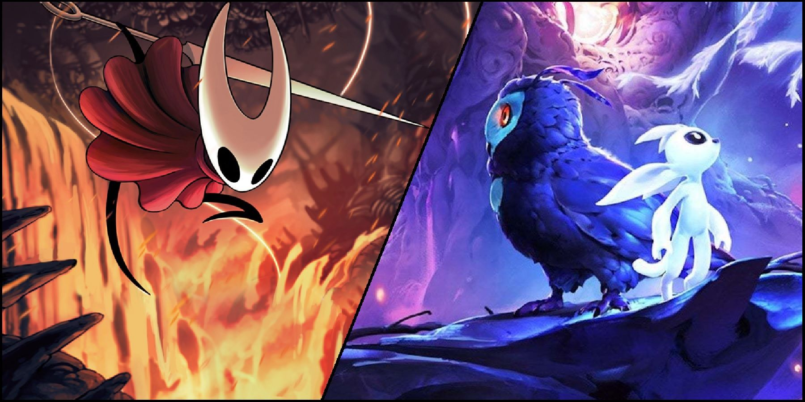

其实按道理来说*Ori*二代应该对标丝之鸽，但是无奈我们现在只有空洞骑士可以玩。现象级游戏是如何诞生的，原本小众的魂系玩法又是如何被大众广泛接受的，可能这些问题都得留待日后的游戏史学家们（如果有的话）去考证。但是毫无疑问，身在历史之中的我们应该能冥冥感受到，看似矛盾的indie culture和mass culture之间也能碰撞交融催生出新的文化产品，广泛地被雅与俗（不含褒贬）共同欣赏、共同接受。没有*Dark Souls*和*Bloodborne*就没有*Hollow Knight*和*Sekiro*，没有*Hollow Knight*和*Sekiro*的广泛传播想必也不会有*Elden Ring*在普通玩家群体中的强烈反响，能看到游戏也像各类艺术史般拥有自己的传承脉络，这真是一件令人欣慰的事情。

---

## **Indie Banquet**

个世界上的独立游戏一茬接一茬地冒出来，我知道我这一辈子都打不完。就算我一年都不打3A而把80%的时间都花在独立游戏上，也只能体味其中的九牛一毛。而事实上2021年我几乎一直在玩独立游戏，尽管加起来也没能玩多少，在此还是不惭挥毫，甄选个中吉光片羽，供诸君玩笑。大致分成三个板块，分别代表本人好恶倾向，而不论游戏品质抑或完成度。

- **Favor**

### **Solasta: Crown of the Magister**

:point_right: **[Notion Portal](https://www.notion.so/Solasta-Crown-of-the-Magister-423a85de13f345c4bddc2d1ebfb6fc12)**

★★★★

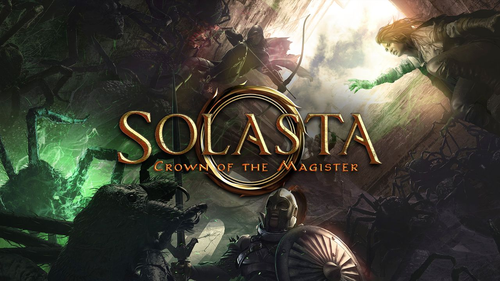

作为一个不管是线下还是网络都没怎么跑过团更不要说带团的人，我对跑团的记忆仍然停留在小学一年级，某位大哥哥领着一帮小弟弟小妹妹，拿着本子记录一些文字、涂鸦，通过口述编造一个个简陋又非凡的游戏世界。而在计算机上接触Pen and Paper TRPG已经是相当久远之后的事情了。由于生不逢时，错过了美式RPG的黄金时代，所以我在游戏技术全面升级的当下补起早期作品来算是兴味寥寥。与这部作品相遇还是两年多之前，彼时还在玩尚未更新到Definitive Edition的神界原罪2，在Steam的同类游戏推荐列表里发现了这个仍在EA早期的游戏。出于一种观望的心态，以及手头大量游戏还没打完的状况考虑，我决定暂缓入手，事实上后续的游戏体验证明了这是一个明智的选择。尽管从未停止开发进程，而且制作组的直播频率异乎寻常的高，但是终究还是受限于预算和技术，导致这个十多人的小组并没能交出一份满意的答卷，甚至在EA结束后这个游戏的完成度依然不算很高，特别体现在文本的匮乏和故事连贯性的欠缺上。但我还是顶着频现的bug和缺胳膊少腿造成的困窘打完了一周目，并且顺手记录了文字时况，收获不多但还算令人满意，真心可算没有错付。令人印象深刻的首先是复古的D&D规则和角色构建（俗称开卡），初见时熟悉系统与设定的过程，以及品味其中的复杂性是我最大的乐趣，有种似曾相识的微妙体验；其次是遵循规则框架的战斗，虽然没有采用半回合制这一优越的战斗模式，但几场设计精良的boss战弥补了缺憾，我对自己独坐屏幕前、绞尽脑汁攻略关卡的场景记忆犹新。

不过哪怕是完全通关后我也并不想在现阶段再次尝试，或者推荐任何一个没有类似游戏经验的玩家以此游戏入门，因为很遗憾它并不能算是优秀，只是我很欣赏主创团队的工作热情与大胆尝试，故而定格下这于我而言雪泥鸿爪般的一段经历。当然通过这个游戏的反响，不难发现有种趋势是一些在这十多年销声匿迹的游戏类型开始逐渐复苏，被上个世代的玩家视若至宝的同时也逐渐被新世代的玩家们接纳。独立游戏敢于向有着复杂结构与机制的传统游戏发出挑战，尝试以小搏大，这对于行业来说是一件好事，也从一个侧面说明电子游戏的市场依然年轻而广阔。

贴一些冗长的原始评论（存在少量剧透:warning:SPOILER WARNING）

对我来说，战斗特别吸引人，有<a herf="https://www.notion.so/Pillars-of-Eternity-Deadfire-d9f20429691d433babe8e147cbf602ac"><i>PoE: Dead Fire</i></a>初见船战的感觉（当然，打多了也无聊了），这主要还是得益于龙与地下城背景本身就有丰富的种族和敌人类型。控制职业各异的四到六人组成的小规模团队，或是屠杀低级人类间谍，或是和旗鼓相当的蜥蜴人鏖战，或者被古神（其实是巨型沙虫一类的生物）一口吞入腹中毫无反抗之力... 这种奇幻的经历本身就已经足够让人兴致大发，战斗规则的丰富多样更是锦上添花。可以利用地形击杀，或者利用克制的法术、装备取得优势，甚至还可以加好Buff硬生生地肉搏。战斗方面，就我体验的这些职业来说，贼除了primary weapon一回合只能攻击一次以外，其他方面真的很强很强。首先是一回合一次的背刺很好触发，只需在视野盲区即可（隐匿后只是增加advantage提高命中率），这和其他游戏相比算是史诗级增强吧；然后是超高的机动性，如果是开阔地图战斗，一人可以溜着一圈怪跑，剩下的靠队友集火点杀，人称拉扯小王子。游侠作为菜刀队主力输出，我点的技能树是Clossure Slayer，攻击中体型敌人有额外伤害；还有一个让敌人借机攻击劣势的天赋方便走位；Favorite Animals 也是随便选的，早知道Element敌人这么多就选这个了；至于优势地形就更是随便选了一个沼泽，全局都没派上过用场。不得不说游侠技能树里鸡肋的部分还挺多的，和动物、召唤有关的都很弱，个人感觉除了输出还算稳定，其他方面差不多属于t2吧。帕拉丁和斗士其实组一个就够了，我蛮想把守序善良的圣骑换掉的，可惜这游戏里没有野蛮人。剩下一个组Mage或者Cleric，看情况是补输出还是奶量（Arcane Missle实乃跑团必备技能）。
    
对于这个游戏，我唯一不喜欢的就是Crafting，因为没有arcane proficiency的队员所以导致什么附魔武器都造不了！！！那我辛辛苦苦打boss刷材料捡垃圾是为了什么！当然，这也只能怪我自己没组法爷/奶妈。而且由于规则所限，没有掌握特定的技能就不能使用相应卷轴；除了毒药以外没有其他的战斗道具（比如投掷物、陷阱等等）；药剂又贵又鸡肋，制造的物品也是同理，而且钱真的挺难赚的。
    
剧情其实算是常规跑团流水账，和开头就组好的伙伴一起，揭穿蜥蜴人的阴谋，集齐宝石再挫败它们召唤邪神Sorr-Tarr的阴谋，力挽狂澜、拯救世界。标准的任务驱动型模式，配上大小地图、副本等人物活动的场景作为“棋盘”，它的全部流程就是一段单人TPRG之旅。但是剧本的缺陷很大，简单且没有突出特点的配角们，令人疲软的最终战斗，以及莫名奇妙的省略。前文刚从圣骑统帅那获得了Sorak的情报，伪装成为人类的渗透者，被杀死后会现出真身，结果后面的剧情所有被掉包的人死了之后尸体都没变成蜥蜴人；第一次获得王冠时出现的幻象战斗，结局时想要首尾呼应结果大场面做得很捉急；原本取不下来的王冠在最终章却直接被省略大法取了下来，最后皇冠里的魔法师还说了一句：我果真没看错你们！真是烂梗味满满了...如果说TRPG的核心在于跑团的主体故事，那么剧情的硬伤与剧本的笨拙就是无法回避的致命缺陷。
    
和JRPG对“旅”的强调重点不同，早年的CRPG和TRPG少有在旅程的中途招募新伙伴，一般会用NPC的交互代替可操控的新角色，核心成员在游戏初期就已经确立，人物形象的作用大多是为了事件而服务的。这种设置其实不难理解，因为TRPG中玩家对主要角色的背景、性格、立场等能进行高度自由编排，不同玩家创造的人物做出的不同选择会先反馈到世界线走向的变化上，最后才折返到人物自身的命运变化，因此剧本中配角的重要性相对于其他RPG更为显著。而传统JRPG的走向基本已经确定，作者要展现的是诸如友谊、羁绊、冒险等以角色为核心的要素，玩家所要做的就是在有限的分支中静静地等待主角们既定结局的到来。
    
说了那么多，其实要论质量，Solasta还远远称不上高分作品，它顶多提供了一次完整的基于D&D 5e rule 的跑团体验，很多细节上差强人意，还需打磨的地方太多太多，总体上只能属于可玩的范畴。但是随着Larian Studio掀起的复古美式RPG浪潮，当代出现了越来越多的同类型游戏，顺便带动了TRPG这一小众genre重新进入越来越多的年轻大众的视野，这当然和目前游戏产业整体的蓬勃发展不无关系。而这个名不见经传的17人法国小制作组敢于把自己的第一部试水之作投入到这个类型的游戏上，属实勇气可嘉，他们的日志更新非常勤快，每次点进steam页面必能看到开发者的直播（或录播）演示视频。虽然Solasta并不一定是我在2021年玩到的最好玩的游戏，但它和主创们努力追求达到的境界，一定是让我最心驰神往的远方。

---

- **Mention**

### **Black Book**
:point_right: **[Notion Portal](https://www.notion.so/Black-Book-82963df215434e1abc6a1a0f4b6a7e82)**

★★★☆

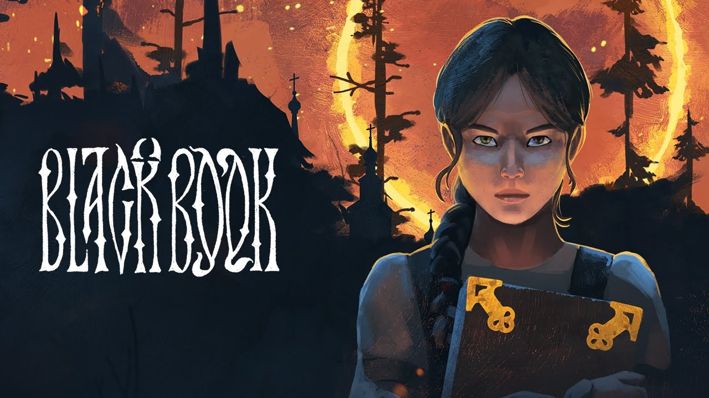

在2021有一个日后会成为非常著名的商业案例的游戏产品，叫做戴森球计划，堪称以小博大的典范。当然在这个游戏*Black Book*下面提一嘴单纯属于碰瓷，硬要对标国产或许和早年河洛工作室的武林群侠传或者开发初期的太吾绘卷类似，处处透露着贫穷的气息，但浑身上下散发着宝贵的灵感和超越游戏的文化属性。其实要说当下的游戏行业完全是个内容产业也不尽然，大厂靠续作圈钱和四十年前的雅达利时代无二，手游公司操弄数值诱骗抽卡就是合法赌博，尚能称作行业之光的独立游戏兢兢业业开发出一种新玩法转头就被全盘复刻，而没有玩法上的创新那就只能像这个游戏一样靠想法创新了。虽然说想得美是一回事，做得烂又是另一回事，但是好歹算是有一个成品，能在时代大浪中翻起一抹小小的水花。

---

### **Iratus: Lord of the Dead**

:point_right: **[Notion Portal](https://www.notion.so/Iratus-Lord-of-the-Dead-05d5a451cac94ebab3936bc1e090b1da)**

★★★☆

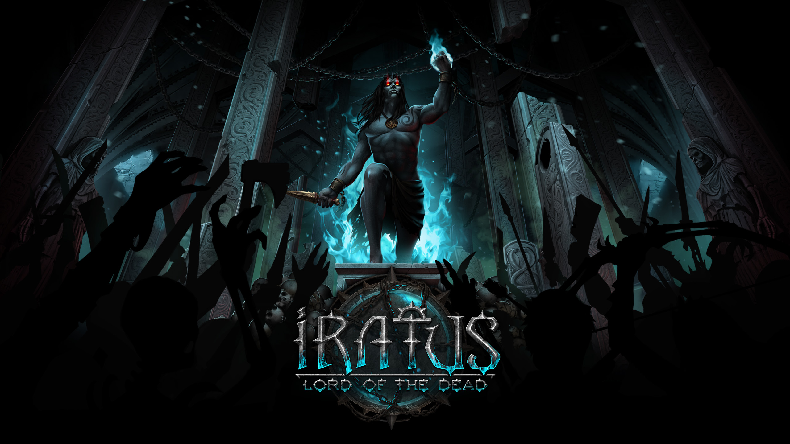

继[*Slay the Spire*](https://www.notion.so/Slay-the-Spire-c5c1f84aa261465198b26afcbc6252ed)将Roguelike-DBG发扬光大之后，[*Darkest Dungeon*](https://www.notion.so/Darkest-Dungeon-4a71e851e5bd496e8759c625f63a476b)的成功也促使各路效仿者们鱼贯而出。其中有无耻换皮手游例如[*Home Behind 2*](https://www.notion.so/2-Home-Behind-2-692c92989fca4911bf530ee06fc2e2b5)，也有做得形似神散的劣质产品例如[*Deep Sky Derelicts*](https://www.notion.so/Deep-Sky-Derelicts-897d62dafd7d465bb1f8d69dc9adc955)，极少数能像*Iratus: Lord of the Dead*一样水平比较接近辐射中心。游戏玩法创新是一件很具有使命感的事情，比如大逃杀比如自走棋，有的创作者功成名就而有的出师未捷身先死。能力越大责任越强，享受前人的成果自然无可厚非，那么是否在自己也成为了前辈后要尝试着开始栽树呢？插一句题外话，2021年12月8日，Unfrozen工作室收到了来自GEM Capital的投资，它们是个专投东欧与中东小型游戏工作室的资本运作公司，这又意味着什么呢？

---

### **Inmost**

:point_right: **[Notion Portal](https://www.notion.so/INMOST-795a282e31ae4e8b8620fdaa7d66e7ed)**

★★★★

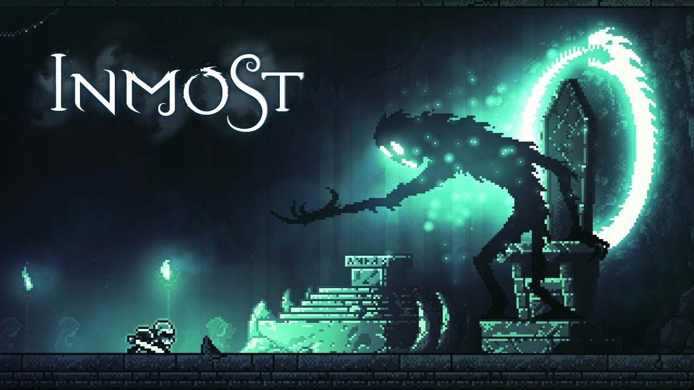

一段微型还魂之旅，一曲怅然的挽歌，眼花缭乱的叙事手法并不能掩盖溢出屏幕的悲伤，正如骑士身上厚重的装甲遮蔽不了他向往光明的内心。这个游戏告诉我们一个真理：生活才是最伟大的编剧，游戏只是借助它的面貌走入现实罢了。

---

- **Patience**

### **The Friends of RINGO ISHIKAWA**

:point_right: **[Notion Portal](https://www.notion.so/The-Friends-of-RINGO-ISHIKAWA-3e8e2b75feb041ed8ac4700a0f571a58)**

★★★

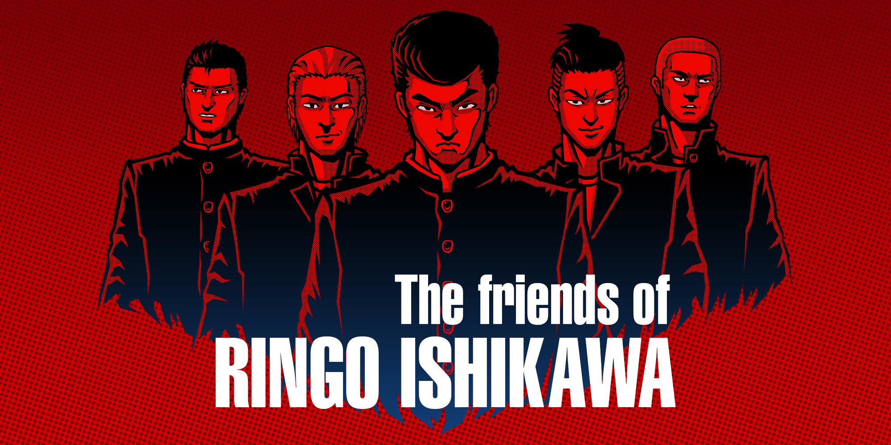

比较可惜的一个独立RPG，潜力非常大——这句话也意味着目前并没有做得很好，而且很久没有发布新版本了，可以说是留下了一个烂坑。在尝试之前建议做好心理准备：能接受层出不穷、莫名其妙的bug，能承受得住努力良久但还是结局凄惨的寞落。好了在此基础之上如果你喜欢热血高校或者东方仗助这样的正派日本不良，那么对角色的认同感会很强，还是能收获一部分游戏体验的。游戏的设计其实优缺点都很明显，可以说是细节丰富也可以说是冗余繁杂，这取决于你为什么要玩这个游戏，以及你有着一套怎么样的RPG哲学。

---

### **Eastward**

:point_right: **[Notion Portal](https://www.notion.so/Eastward-a1617ffd3e0c4a8d8340aefadc17a969)**

★★★☆

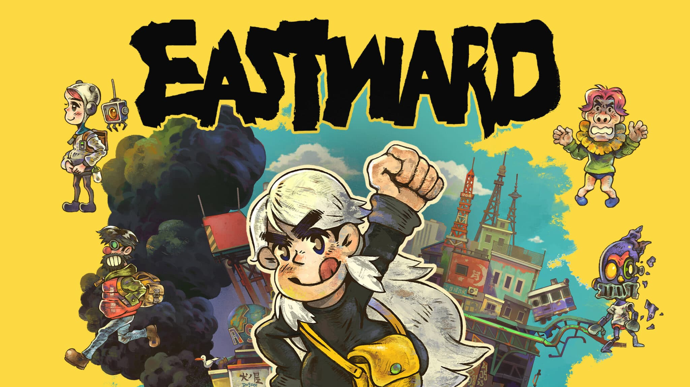

除了游戏设计什么都好，准确地说大地之子也好玩，就是本体不好玩。设计师对于节奏的把控堪称灾难级，复古是可以理解的，不过很显然在剧情、谜题、探索、交互和战斗之间的转换并没能实现像*Zelda*般行云流水；编剧对于策划定下的慢节奏调性的配合无可厚非，可以想见开发资源中的一大部分是倾斜向对话和文字细节设计的，但是支线剧情这样设计也就罢了，没有哪个游戏会堆砌海量无意义文本只为营造所谓的生活化气息的，未免有些舍本逐末；最无可挑剔的就是美术设计，对于地图景别和层次的架构别具匠心，细微之处比如食材和家具的贴图也处处散发温馨之感，风格浓厚的情况下还能做到与游戏的核心理念相辅相成，实属不易。

---

## **Mobile Jotting**

由于社会环境局限，许多年轻一代在跨越了电视游戏机这一媒介后，短暂接触过电脑游戏就立即跨入了移动端游戏的时代。而我大概就是其中之一，只不过在新时代我既没有选择弥补缺失，也没有选择跨过鸿沟，而是维持了从小养成的在电脑上玩游戏的习惯，偶尔在手机上玩一些目的明确、操作简便的游戏。本就是FPS苦手的我自然更不可能尝试COD或者PUBG等竞技性极强的移植版游戏，所以上手难度低、注重策略而非对抗，且有着不俗关卡设计的各类游戏不断受到我的青睐，而各类适宜中老年玩家的casual game例如消消乐当然也因为趣味性不足被我排除在外。下文分为两个板块，分别是我在2021年玩到的几款优秀爽游和轻策略游戏，并在此基础上进行适当扩充，也可以算作半回忆向半推荐向的私人絮语吧。

- **Dopamine Hit**

### **Oddmar**

:point_right: **[Notion Portal](https://www.notion.so/Oddmar-7a512ff3685b47918cb06ff166bf6d29)**

★★★★

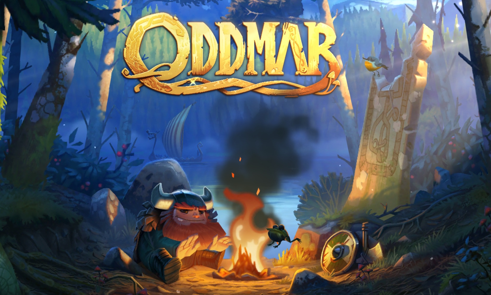

虽然本质上是横板跑酷游戏，但是有着如此精美的艺术风格和精良的操作手感却被称作爽游，略有失公正。*Oddmar*是在年关将近时加入Apple Arcade的游戏，不过其品质已经在三年前发售时就得到了广泛肯定。融合了平台跳跃的纵向设计和跑酷游戏的横向设计，其关卡之精巧堪称集大成者；而且丰富的剧情与局内玩法将本来枯燥乏味的游戏类型转变成为可供欣赏的艺术品，而不再是依靠两根手指就能攻略的无脑爽游；同时兼具爽游短平快的特质，随时随地拿出手机用上三分钟即可再打一关。这种吸收各种genre长处又能自主创新的游戏确实少见，尤其是以跑酷为核心玩法的手游，值得一试。但是从传播学的时效性角度来看，作为一款各方面都远超神庙逃亡、地铁跑酷等现象级游戏的存在，却并没有获得与之艺术创造相符的声誉和营收，只能说是“第一个吃螃蟹的人”留给大众的印象太深，因而更加感叹[植物大战僵尸](https://www.notion.so/Plants-vs-Zombies-a38f253a8b7641f38a75f883db16476e)等游戏的伟大之处了。

---

### **Space Marshals 2**

:point_right: **[Notion Portal](https://www.notion.so/Space-Marshals-2-8f0fb5ef00e0461aacce1c82730d3b70)**

★★★☆

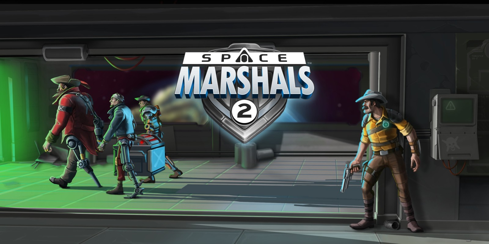

随着诸如Alien系列等游戏不断移植到移动端，像*Space Marshals*这类上个时代的ip与Gameloft的大部分动作冒险竞速游戏早就丧失了竞争力，最终的归宿只能是被冠以“经典”的头衔供少许怀旧玩家回味。*Space Marshals*系列一共有三部作品，但是我只反复打过第二部，因为那是我最早在移动端接触到的游戏之一，它的关卡设计让五年前的我耳目一新。即便放到今天重新体验，也有可圈可点的地方。但是对于从来没有接触过的玩家来说，它们已然是一些应当落幕的古董了。可能日后在评价同样是我最早在iphone上接触到的游戏魔女之泉时我也会说出类似的话来吧。

---

### **Bleak Sword**
:point_right: **[Notion Portal](https://www.notion.so/Bleak-Sword-9fd2de4b0b1b4737bb659aca98471ea3)**

★★★★

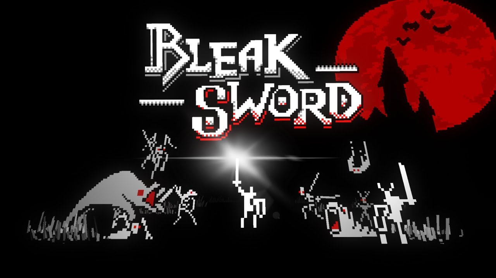

如何通过指尖跳跃实现魂系战斗？只需要在游戏设计时抽离出原型，再以加工修饰过的形式移植到移动端的作品中即可。原教旨魂系战斗的原型是“触发”，有点类似音游而不像类型上更接近的格斗游戏。因为重要的不是华丽的连招和精湛的操作，而是掌握时机的能力与经验，弹反的时机、翻滚的时机、走位的时机、出招的时机等等，战斗考验的是玩家能否在转瞬即逝的时间节点触发对应的指令。因此*Bleak Sword*在战斗设计中运用的就是相同的原理：在合适的时机点击或滑动屏幕，其实水果忍者、神庙逃亡采用的也是类似的逻辑，只是晦暗的画风让它更容易使人联想到*Dark Souls*系列作品罢了。

---

接下去是略短的爽游推荐环节，挑选亲测很爽的爽游给大家一起爽一爽，不限于2021年游玩。五个游戏里四个都和丧尸有关，好奇是不是爽游/爽片的创作者早已摸清玩家对于题材的偏好了？

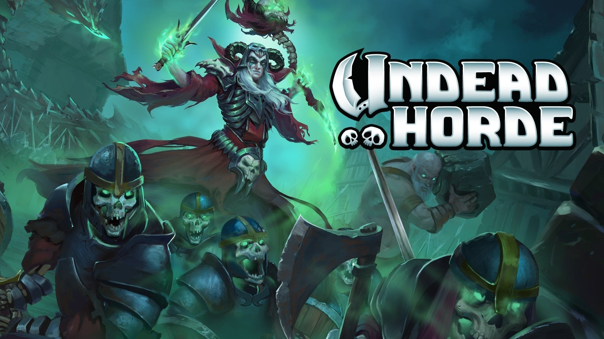
除了刷刷刷爆装备的大菠萝玩法很爽以外，我感觉应该不只有我一个人能通过“把敌人变成自己的手下”来获得奇怪性癖的满足吧。什么？你说它们都被复生成了亡灵而你自己是个necromancer？那不是更爽吗？

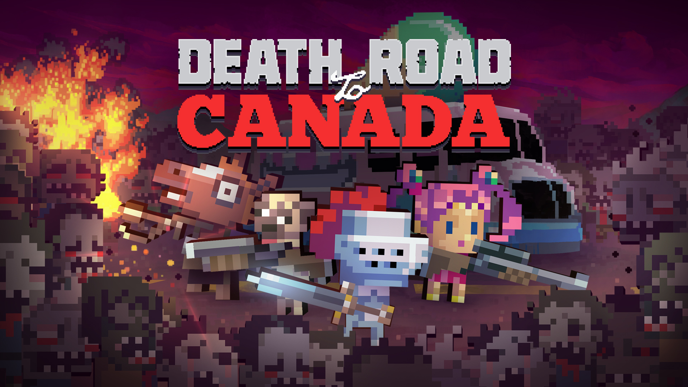
事实证明简单的搜刮+砍杀+跑图玩法，也能获得充分的爽感。虽然把丧尸换成外星人或者野生动物或者越共理论上并不会影响游戏基本盘，但是我只是个爽游啊，爽游只要负责爽就好了！

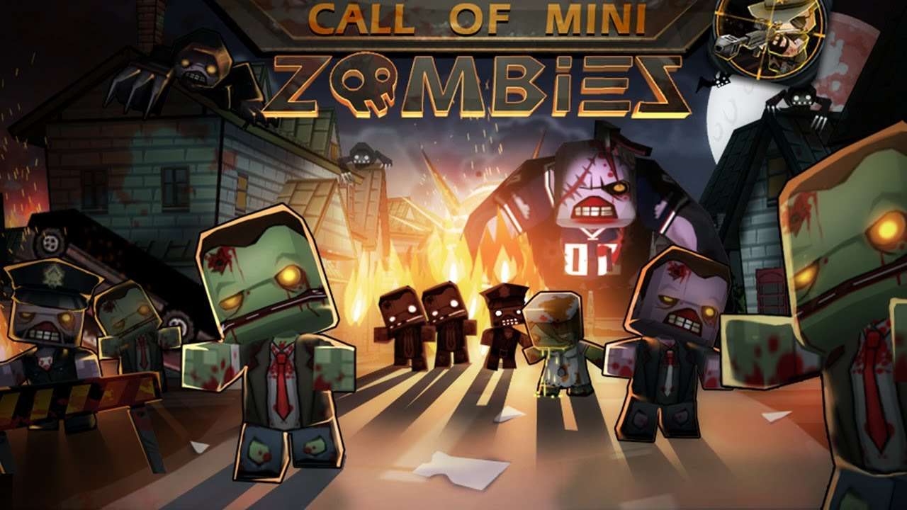
我的第一部iphone上的第一个射击游戏，毫不夸张地说这个方块头僵尸系列在当年的移动端出现时带给我的震撼丝毫不亚于COD / PUBG mobile对现在的小孩子的震撼。那个时候我因为带手机去学校玩这个被老师抓到还吃了警告处分，当然啦现在看起来肯定是非常落伍的，就当是回忆向+凑数的好了。

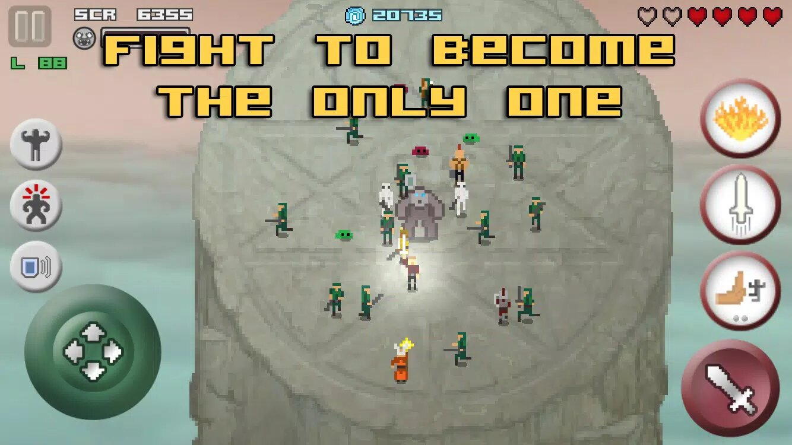
那个时候的ios系统还很简陋，所以并不觉得这个游戏的画面很落后，好吧现在看来真的有种掌机时代的感觉。战斗模式也很单一，就是无限生存一直杀boss和小怪，很像童年页游回忆之僵尸危机3的单人模式。不过好在怪的种类很多样，可操作性也更好，同属于回忆向！

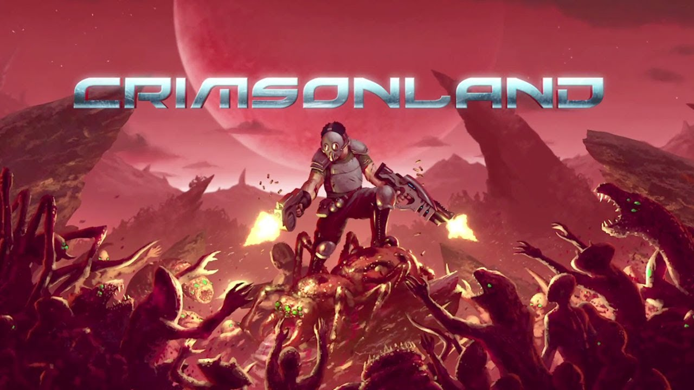
不知道为什么在2022年这一类型的爽游又开始火了起来，由*Vampire Survivor*掀起的文艺复兴实际上源起于这个古老的游戏。我最早开始在PC上接触到血腥大地的时代比上面两个十年前的游戏还要早得多，现在它在appstore上有着完全重制版，而发行商也正是推出了上面推荐的亡灵法师游戏*Undead Horde*的10tons Ltd，如果吸血鬼幸存者玩腻了不妨试一下这个远古时代的产品吧。

---

- **Light Strategy**

最后是三款战棋游戏，都是在Apple Arcade上淘到的惊喜之作，操作简单容易入门，对我来说最重要的是这个游戏类型中的大多数几乎不需要刷，游戏性来自关卡设计和运筹帷幄，而非数值堆砌带来的割草快感。

### **Legends of Kingdom Rush**
:point_right: **[Notion Portal](https://www.notion.so/Legends-of-Kingdom-Rush-eeb0effb846842d7b4fd8565ee669102)**

★★★★☆

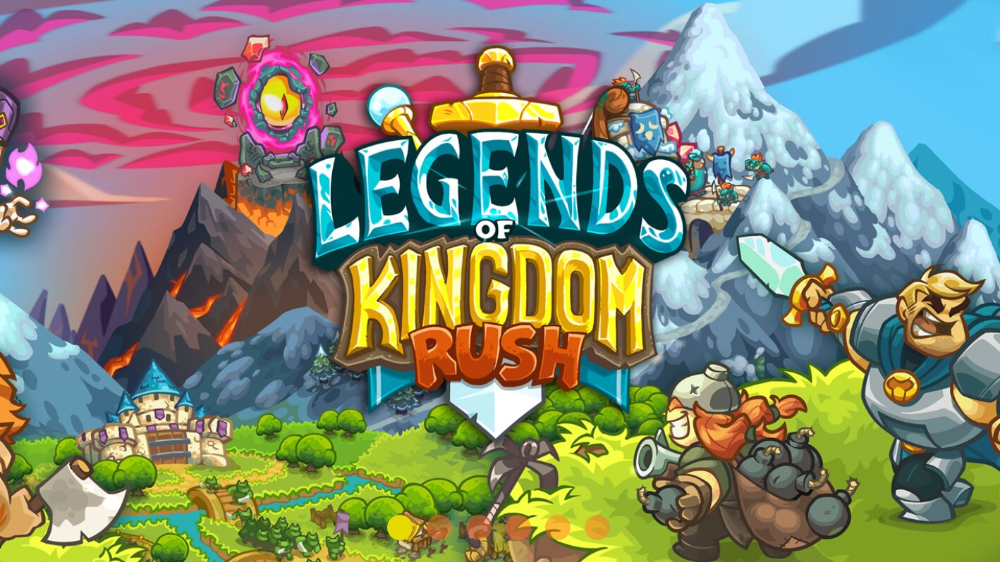
还是熟悉的配方，还是熟悉的味道，由Ironhide带来的经典TD系列游戏Kingdom Rush的续作悄然转型，向着SLG领域进发。这已经不是他们第一次尝试跨越游戏类型了，在[*Kingdom Rush: Vengeance*](https://www.notion.so/Kingdom-Rush-Vengeance-78385eb5477f4811b08d9e786de03876)之前就有过一次大胆的突破——*[Iron Marines](https://www.notion.so/Iron-Marines-306e8d273fee42c8aff701a480b8dd54)*，一款星际风格的移动端RTS游戏。Legends继承了工作室一贯的美术风格和UI设计，玩过前几作的老玩家对这种赏心悦目的界面一定不陌生，新接触的玩家想必也会眼前一亮。至于游戏内的角色，则更是KR世界观下的粉丝向出演，从[*Kingdom Rush*](https://www.notion.so/Kingdom-Rush-2eb0341b64694f8d9abab14c81e00984)一代就能接触到的圣骑士和地狱骑士，到二代的恶魔领主、三代的骷髅女巫，甚至连防御塔上的角色都可以作为英雄单位在棋盘上操控。敌人也还原了塔防游戏中的原型，山贼、兽人、巨魔、树精，以及本作原创的触手教派，不同派系的敌人种类丰富，Boss战设计也妙趣横生。美中不足的是体量实在过小，2022年上线PC端后除非多更新几张dlc地图和角色，否则短短8小时的流程很难让大部分玩家买账。最后贴一下前几代KR作品，都是不可多得的经典！

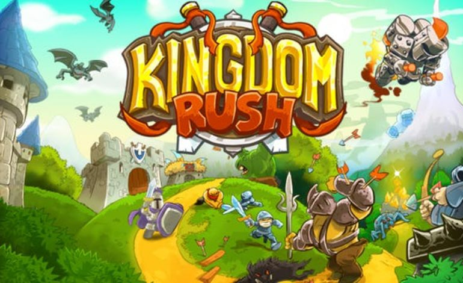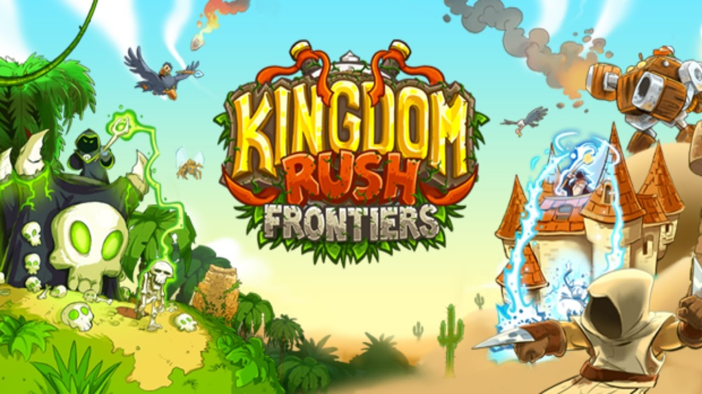

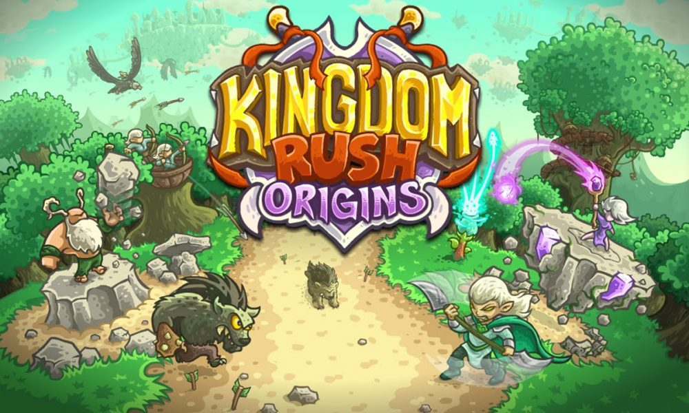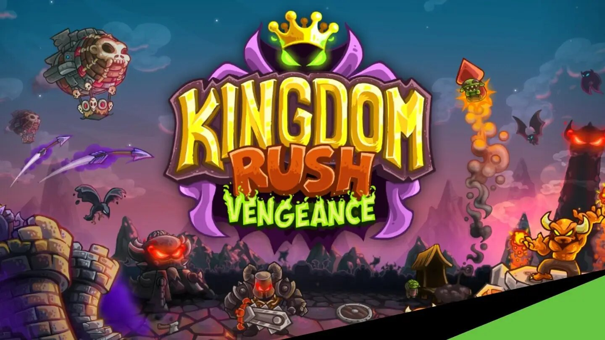

### **Spaceland**

:point_right: **[Notion Portal](https://www.notion.so/Spaceland-fb723a7f1bef4c1890b97d07fd74f392)**

★★★★

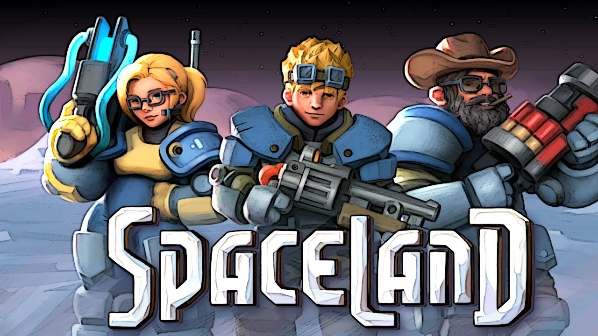

太空题材的科幻战棋，虽然移动端已在2020年前后移植了[XCOM2](https://www.notion.so/XCOM-2-54b01be30496406b95ea665a1f0cdcc8)和[*Into the Breach*](https://www.notion.so/Into-the-Breach-b71968f6924f40359bc1517a1b18a7b8)这些堪称同类型制霸的精品，但是该玩的在pc上也早就玩过了。既然Arcade中可以体验到全新的同类游戏，花上短短六七个小时小酌一番又能有什么损失呢？这部作品的体量是为手机游戏量身定制的，关卡和内容都比较少，因此也很容易通关。但是短短的流程既包括了战斗和剧情，还有不错的解谜和收集要素，从结构上看已经是一个五脏俱全的产品了。

---

### **Spelldrifter**

:point_right: **[Notion Portal](https://www.notion.so/Spelldrifter-ed915d50a4114abfa71b8c126777fbea)**

★★★☆

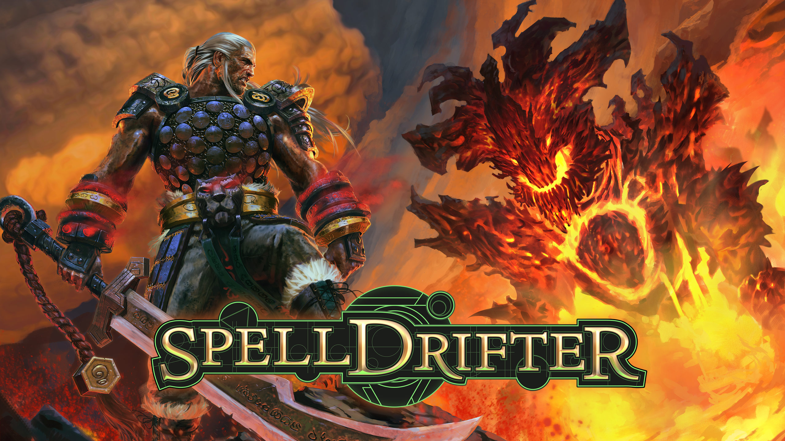

奇幻世界观卡牌战棋，故事背景类似龙与地下城和中土世界的结合体，可以选择的职业也包括战士、法师、盗贼、牧师等。总共有三大场景，敌人从人类、元素、机械生物到亡灵、恶魔、邪神应有尽有。不过游戏玩法不只是单纯的网格战棋，还有rpg养成元素和rogue卡牌构筑系统，不同职业的角色拥有多种可供选择的机制，以不同的技能卡和装备为核心可以创造出效果各异的打法流派。创新的机制在于部分技能借用了dnd的设定，虽然没有那套规则复杂的伤害检定系统，数值也基本是固定的而非依靠投掷骰子决定，但是一些技能还是可以看出灵感来源，例如牧师和法师需要channel持续施法或者延迟结算的高伤技能，就是参考了dnd中conjuration系法术的设定（个人感觉有个技能甚至有直接致敬牧师的五环法术Flame Strike的嫌疑）。

---

## **结束语**

拖了半年时间断断续续才写完，一方面是因为好像真的没什么内容，拼凑出的文字总是欠缺真情实感，另一方面是拖得久了就顺延下去更不想写了。直到打算把年度游戏总结搬运到博客才坚持着继续填完这个坑，相比2020年总结肉眼可见的质量下滑也是在所难免。所谓的一整年时间都在玩独立游戏也只不过是为自己的怠惰找借口，不想接触更广更深的游戏类型、不想重整精神投入艰难的跋涉中，所以将更多的时间挥霍在移动设备之上。当然我自认为电子阳痿这种精神疾病（笑）距离我还是比较遥远的，于我而言在游戏海洋中遨游时比起扮演一个“玩家”我更愿意接受“观者”的身份，保持每时每刻抽离其外思考现实世界与虚拟世界的联结，这也是为什么在每段感想的开头总会有一段描述性的文字概括我那惨不忍睹的游戏经历。到2022年为止都没能在游戏技术领域有任何的深入学习，对于理论也是浅尝辄止，距离真正的创作更是遥遥无期。结合惨淡的人生现状和凋敝的时局，不得不感叹2021年真是各种意义上的低谷啊！