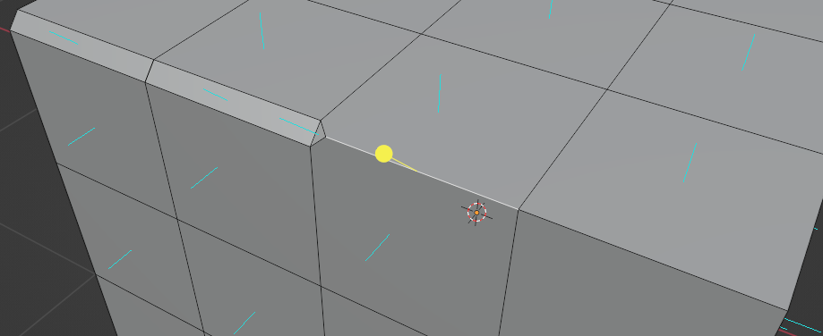
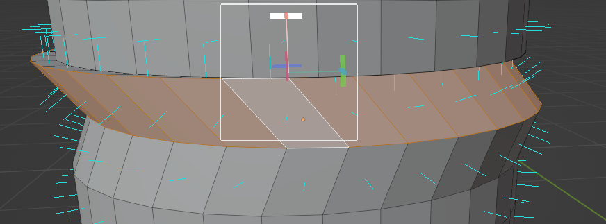
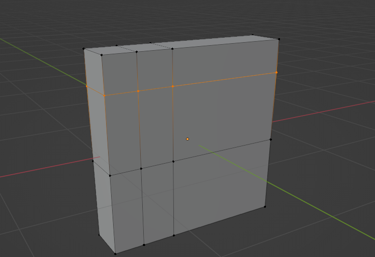
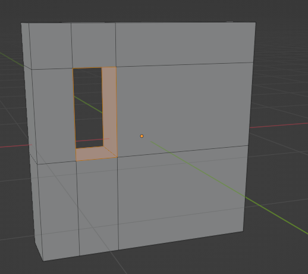
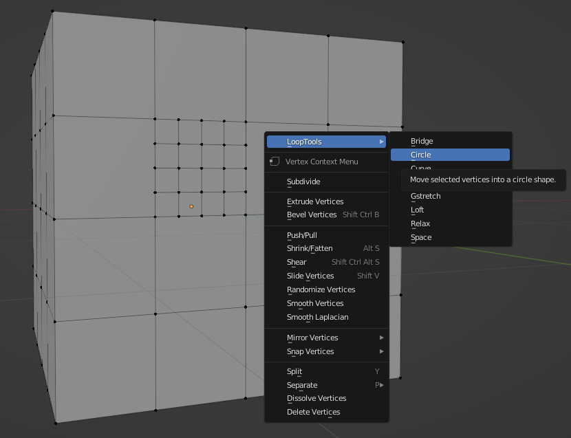
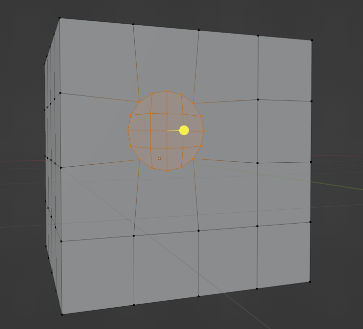
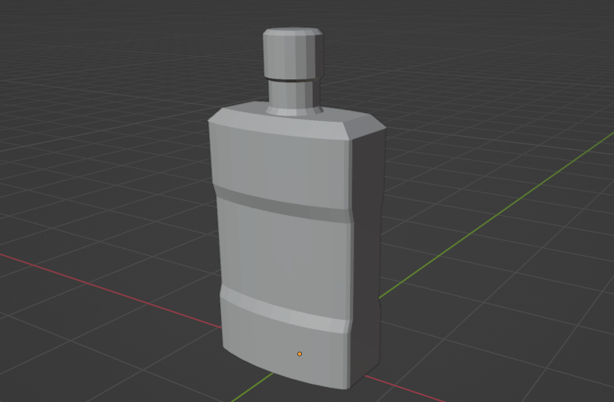
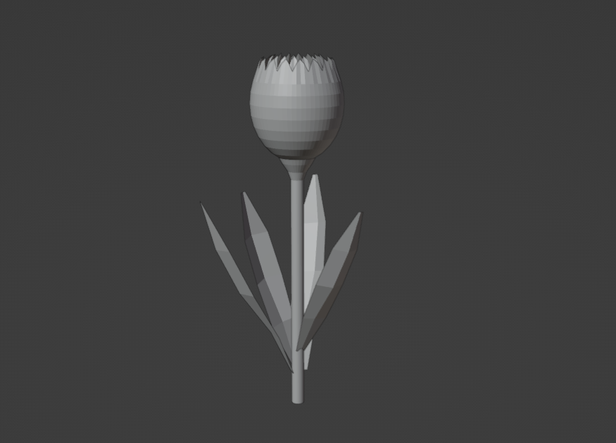

## 基础操作
- 三视图：小键盘，俯视图 7；正视图 1；侧视图 3；四视图模式 ctrl+alt+Q
- 移动 grab：选中物体后鼠标点击左侧边栏自由拖动，快捷键G；按住坐标轴拖动可以沿着坐标轴移动，按住平面拖动可以在平面内移动。
- 旋转 rotate左侧边栏旋转快捷键R；按住与坐标轴相同的曲线可以沿着对应坐标轴旋转。
- 缩放 scale：左侧边栏缩放快捷键S；按住坐标轴拖动可以沿着坐标轴缩放，按住平面拖动可以保持该方向大小不变在另外两个方向按比例缩放。
- 复位：alt+G移动复位，alt+R旋转复位，alt+S缩放复位。也可以在transform中手动输入原始数据进行复位。
- 删除：选中物体后按X，提示是否删除；选中物体后Delete不提示直接删除。
- 复制：ctrl+C/V在原位复制；shift+D复制后直接抓取。
- 游标 cursor: 可以通过手动移动改变位置，可以通过选中物体->右键snap->调整游标位置，也可以在游标工具上方选择吸附模式（激活小磁铁标志就是自动吸附，选择vertex/edge/face则是分别吸附点线面）。可在右上角的overlays界面打开或关闭cursor显示。overlays中还有statistics选项，可以开启点线面个数的统计信息。
- 原点 origin: 通过游标工具将游标定位到想要选择的点，再右键set origin选择将原点设置为游标所在位置即可。

## 认识模型
- 点线面：长按选择工具可以弹出二级选框，有框选模式、刷选模式、套索模式等。shift加选，ctrl减选，a全选。
- 面的基础操作：细分subdivide，在左下角设置分割的面数；删除面，可以选择仅删除面或者删除面和线；挤出extrude，将一个面向外拉或者向内压缩；内插insert，选中面后快捷键i，将选中的面向内缩圈，可以设置为外插outset。
- 面的分割：尖分poke faces，在面中心添加新的顶点拆分成三角形；三角化triangulate faces，不添加新的顶点将面拆成三角形；融并面dissolve faces，将分割的面融合为一个面。切割工具knife，快捷键K，shift（快捷键因人而异）吸附线的中点，回车确认；整体切割biset，选中多个面划一刀，黄色箭头表示法线方向，填充fill可以补上切面。
- 面的法向：在右上角Overlays中可以打开显示法向normals的按钮和面朝向face orientation的开关，用于确定模型的内外两面；也可以在Shading中勾选背面剔除Backface Culling，取消对内面的渲染。
- 面的填充：相当于删除面的反向操作，选中所有边线后快捷键F即可自动填充，也可在上方栏的Face中手动选择，普通填充方式fill是alt+F用三角形填充，栅格填充grid fill是用四边形填充，山歌填充只支持偶数边线的填充。
- X光模式：右上角Toggle X-Ray可以查看透明的模型，快捷键alt+Z。
- 衰减编辑：Proportional Edit由上方工具栏的一个同心圆图标控制开关，在拖拽平面时牵动周围的面柔和地跟随改变。

- 线的基础操作：切分subdivide和面相同，滑移edge slide沿着邻边轨道进行移动，融并dissolve将边线消除使两个面相融，倒角bevel将边线磨平；环切loop cut，循环边通过alt+LMB选中，并排边通过CTRL+ALT+LMB选中（就是纵向选择alt加左键，横向选择alt+ctrl+左键）；切变shear可以在选中循环边或循环面之后向内或向外扭曲。

- **桥接循环边**，将一组数量相等的循环边之间相连形成面。墙体打洞示例：1.首先添加一个立方体，通过缩放功能将其压沿一条轴缩成窄墙，在墙面进行环切。2.切换到Face Select选中要镂空的面以及它的对面，在Edge中选择桥接循环边Bridge Edge Loops。另一种方法是选中要镂空的面上的一条边与对面的同一边，再选中所有循环边后桥接循环边。

- 边的法向：边的法向是相邻两面的法向的均值。还可以通过法向坐标系Normal，选中边后观察Z轴方向确定边的法向。

- 点的移动：grab选中后在平面内自由移动。点的滑移：shift+v让点在固定的轨迹（线）上移动。
- 点的合并：又称为焊接，将邻近或重叠的点进行合并。选中两个点后选择Merge Vertices，快捷键M，合并到中心At Center。倘若两点过于靠近而无法选中，可以开启X光模式选择，或者选中所有顶点，选择按距离合并By Distance即可自动合并靠近的点。还可以在右上角的option中设置Auto Merge让重叠顶点自动合并。
- 点的倒角：选中一个点后进行倒角bevel，在倒角中选择点模式vertices即可。用插件**LoopTools**可以将点倒角产生的图形变为圆或四边形等。

- 点的连接：选中两点后，快捷键F连接但不切割，快捷键J连接两点并切割平面。
- 点的删除：和线面相同，快捷键X删除，会同时删除它们构成的线和面，融并点不会删除面和线。

- 模型合并：框选要合并的两个物体，右键合并，快捷键ctrl+J
- 拆分和分离：拆分Split，快捷键Y，仍然为一个物体；分离Separate，快捷键O，拆成两个物体。
- **BoolTool**插件：对模型进行交集、并集、差集等操作。快捷键N打开右侧边页，在编辑Edit中找到BoolTool，即可进行操作。

## 认识曲线
- 贝塞尔曲线Beziel：曲线有两端点，每个端点会延伸出一条轴线，可以通过框选工具选中曲线或轴线的端点后进行调整移动Tweak。

## 简单练习
瓶子：1.先添加一个圆环circle，将顶点数改为32，通过缩放工具scale压缩为长短径约为2：1的椭圆，删除左右两侧的几个点后连接形成封闭图形，填充fill。向上拉升Extrude形成瓶身立方体，在顶面内缩insert，略微拉出缩进平面，设置深度depth为合适范围。2.对瓶身环切loop cut四段，上下两段距离较近的作为卡线，选中中部循环面法向收缩Shrink。3.在顶部再次进行内缩，对内缩面使用LoopTools转化成圆环，设置圆环半径为何时范围，向上拉升形成瓶口。对上升的圆柱进行内缩、环切、法向收缩等操作。4.瓶身倒角，使边缘棱角部分略显柔和即可。

郁金香：1.先添加一个经纬球UV Sphere，将顶点数修改为32，主视图打开X-ray模式框选上面三圈的点并删除。按住alt选中顶部环上的所有点，间断选取Checker Deselect选中环上间隔的点，自行设置间隔选取数，随后在Proportional Editing模式下向上拉伸，可适当缩小曲线弧度。最后进行缩放scale使拉伸出的顶端略微缩进，复制物体并缩小调整位置，构成内圈的重叠花瓣。2.添加一个圆柱cylinder，调整大小与位置，在顶端环切并放大作为花托。3.添加一个平面plane制作叶子，横纵环切制造出点，对其进行缩放调整。选中所有点后移动，使中心调整到叶子底部，便于之后的旋转操作。复制几份叶子，调整大小与摆放位置，郁金香就做好了。