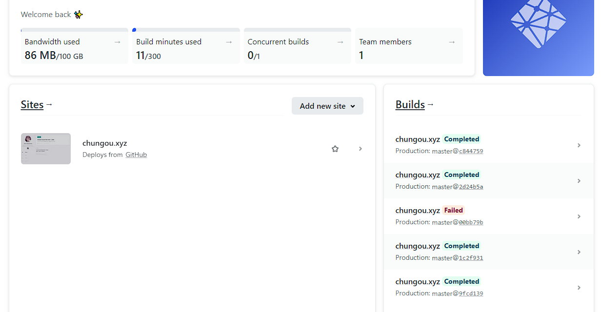
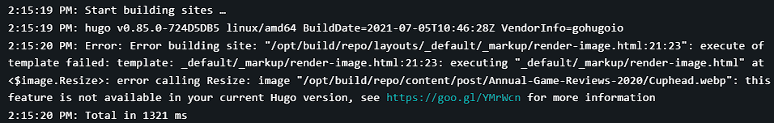
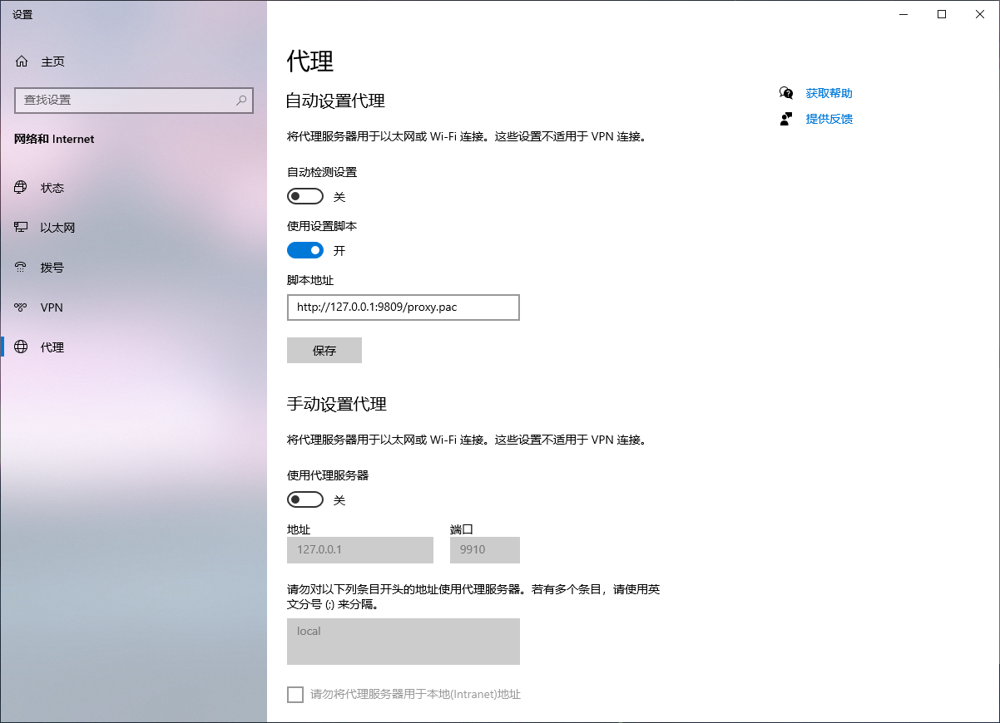
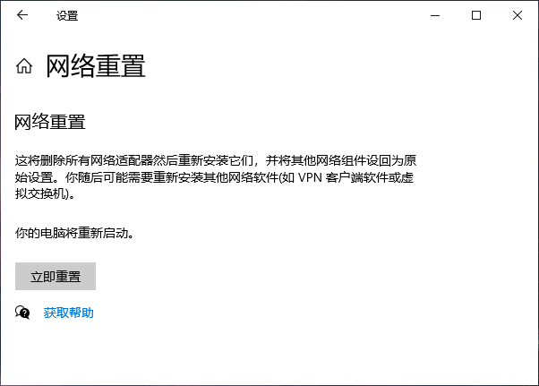
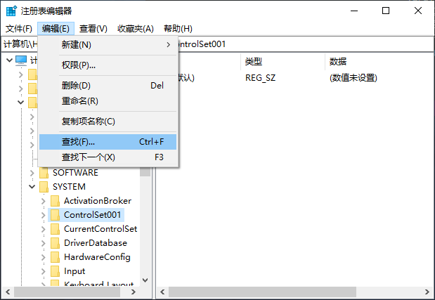
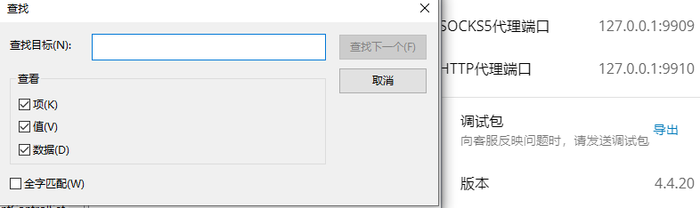
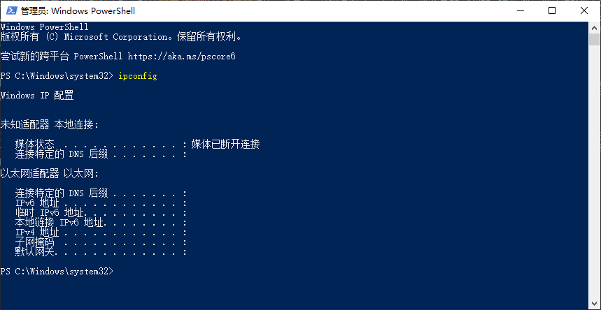
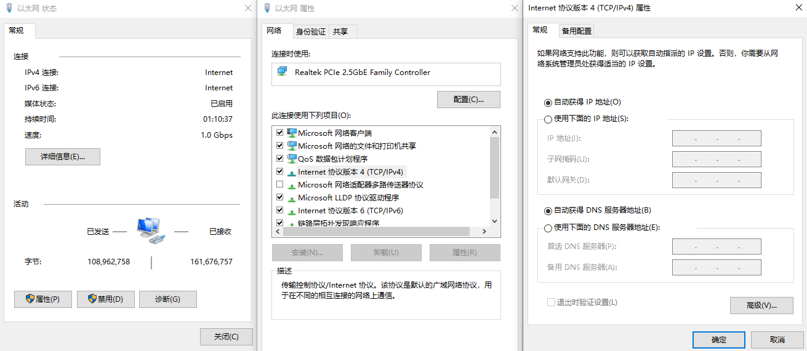
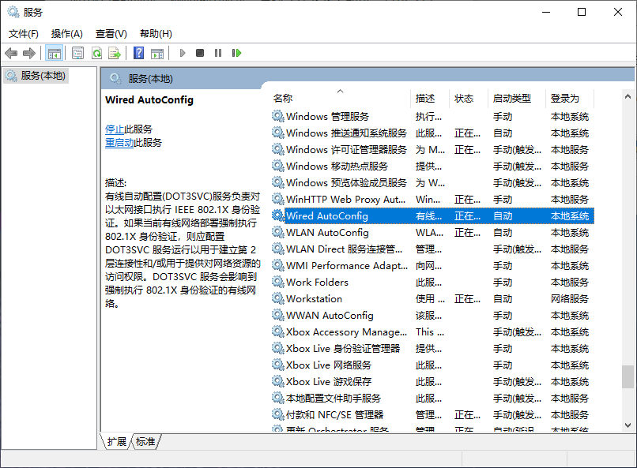

## **博客搭建**
### **心路历程**
其实在搭建博客这件事上纠结了很久，也看了很多相关的推荐文章，例如最早看到的是konatasick的[博客方案推荐toot](https://moresci.sale/@konatasick/105558677388097877)。不过在那之前，我就有了自己的Notion主页和一个wordpress动态博客，因此比较向往的是docker+vps部署博客的模式。但是经过再三考虑，一旦要购买自己的vps，那么肯定不会止步于搭建一个博客那么简单，至少会继续搭梯子、建站加入fedi、搭Matrix用于聊天和直播、搭自己的音乐网站等等，那么可以想见投入的学习与维护成本将是黑洞级别的。由于自己只有少得可怜的Linux / Python / Java基础，所以暂时搁置了这个计划。直到发现了另一个博主Gnpink分享的[Hugo个人博客搭建经验](https://m.cmx.im/@Gnpink/107890349003555006)，发现博客主题已经有前辈写好，如果要diy只需要自己修改一小部分前端代码即可，于是决定在自己的新电脑组装完成之后搭建一个本地静态博客。
### **Hugo+Netlify+github**
于是很快就安装好了Hugo，部署在Netlify上，并在github上fork了主题仓库，下载到本地进行个性化编辑。这些都是根据教程按部就班地操作，没有什么技术含量，只是我没有选择推荐的vercel服务，而是投向了netlify，理由很简单，vercel需要手机验证（来确认发送请求的是人类）而我厌恶这种行为。为了在netlify上部署个性化域名，我又去域名供应商网站上转移了DNS，和相处了一年半的托管服务商Cloudflare说了再见。

之后的工作就是对本地文件进行修修补补，在config文件中增添和删除各类信息，努力将这个网站装饰得更有自己的气息，前后大概花了我一周左右的闲暇时间。
### **Markdown格式文章**
由于之前没怎么写markdown格式的笔记，用Obsidian也是半年前才刚开始的事情，所以起初在书写博文的时候因为不熟练确实犯了难。但是熟悉了语法之后发现并没有想象的那么复杂，再加上强大的支持系统，可以方便地插入html结构和latex公式，我甚至有些爱不释手。和大多数人的选择Typora不同，我并没有用它作为markdown文本编辑器，而是直接在VSCode中敲字，同时打开Markdown Preview插件对照。看着满屏幕花花绿绿五颜六色的文字块，恍惚间有种自己初学javascript时的错觉。

但是实际上写下这篇博文之前我并没有码多少字，第一篇文章[Annual Game Reviews - 2020](https://chungou.xyz/2021/annual-game-reviews-2020/) 是从notion搬运过来的，导出为markdown格式后我自己又修改了一部分内容，包括重新筛选图片、修改整体结构、添加各类html标签等等，过程中也踩了很多坑，不过最后的成品还算令人满意。这有一部分要归功于Stack博客主题的作者，如果没有他的[文档](https://stack.jimmycai.com/)指引，我可能还要摸黑探索很久。

之后大概会陆陆续续搬运更多的文章到这个网站上来，也会发一些原创的博文，比如电影推荐和技术探索之类的杂谈。没有固定的主题和时间，一切随爱好和心情摇摆，我觉得我探索世界的窗子又多了一扇。

### **踩过的坑**
这里用来记录一下博客布置过程中因为操作不熟练而遇到的大大小小的麻烦，有些只是一个单词的typo但足以让hugo报错，有些莫名其妙的bug让我回退了几个版本重新写才解决问题。总而言之做个简略的建站笔记，如果后来人遇到同样的问题说不定也能找到解决方法。
- 文档文件必须命名为index.md存放在post文件夹中，而且导入的本地图片也必须和index文件存放在同一个目录之中。这个问题应该是属于文档没看仔细，从主题作者提供的文档中可以找到很多类似问题的答案。

- 遇到bug可以先查看托管网站的报错，如果看不出来或者不是托管服务商的问题，可以先在本地文件夹bash输入```-hugo server``` 离线运行（但是大概率hugo也会报错），在bash中查看具体问题所在。目前为止我遇到的小错误都是自己手残或者没有按照格式敲，偶尔是不小心注释掉了一些关键的配置文件。


接下去是由于我的菜狗行为整出的一地鸡毛，和博客搭建无关，请自行忽略。
## **网络重置**
起因是这样的，昨夜一宿未眠在玩[*Subnautica*](https://store.steampowered.com/app/264710/Subnautica/)，直到中午吃完饭一口气睡到下午五点，结果发生了一件99%使用代理软件翻墙的人都会遇见的事情——电脑关机时代理软件未正常关闭导致重启后无法连接网络。刚装好系统的时候由于心慈手软，在设置中的**电源和睡眠**一栏选择了5小时自动进入睡眠状态。然而说是睡眠，实际上当我醒来才发现电脑自动关机了，而重启后果然无法再次连接网络。

鉴于我有着丰富的Clash使用经验，所以也没当回事，以为重新打开代理软件再正常退出即可，然而这次我使用的是[Geph迷雾通](https://geph.io/en/)... 这种重开退出的方法显然不奏效，而最简便的方法显然是直接在**网络和Intnet**界面关闭代理服务。然而我并没有那么做，而是在上面的状态栏进行了**网络重置**，这个操作将是我学习如何解决“<span style="color:red">非正常关闭代理导致网络连接失效</span>”问题的开始。（也就是说，其实我的网络根本没有问题啊啊啊！！！）

首先，最应该做的事情就是去上面显示的代理一栏把所有选项关闭，再重启代理软件后正常退出。以后也要保持这些选项处于关闭状态，否则下次不注意还会出现相同问题。但是貌似原生v2ray会存在无论怎么修改都会自动打开的设定。如果这样尝试后仍然没有网络连接，那么就需要去注册表清理地址文件，可以依靠第三方软件例如[CCleaner](https://www.ccleaner.com/)等，也可以手动操作。还是同时按住win+R后输入```regedit```打开**注册表编辑器**，在上方编辑选项中查找所用代理的地址，例如图中所示，查找```127.0.0.1```即可，将包含目标结果的文件夹以管理员权限删除即可。

但是检查网络连接后Microsoft诊断显示ip地址未分配并附上一个红色的感叹号，于是接下来我的操作是以管理员身份打开windows powershell，尝试重置ip。首先输入```ipconfig```检查各项地址信息，再输入```ipconfig /release```和```ipconfig /renew```以重置ip地址的分配。

保险起见，再去网络连接状态栏，打开**更改网络适配器**选项，查看当前网络的状态。在属性一览查看IPv4和IPv6的属性，确认选择“自动获得IP地址”与“自动获得DNS服务器地址”两项。这是为了应对重置网络后产生的“<span style="color:red">无法解析DNS地址</span>”报错的问题。插一句，为了将重置后的网络设置恢复，还需检查service中的两项网络服务是否启用。同时按住win+R后输入```services.msc```，找到 **Wired AutoConfig** 和 **WLAN AutoConfig**两项并根据自己的网络连接需求启用。


这样一整套操作下来后基本上就能解决代理问题了，当然最先应该做的事情就是检查**网络和Intnet**中的代理服务，我浪费了两小时一直在绕圈子折腾网络重置后的恢复操作。最后发现其实早就关闭了代理设置，一直显示无网络连接也不是系统的问题，在我重启路由器之后迎刃而解。总结：就和维修电子产品、修补程序bug一样，最先排查的一定是最简便的相关问题，下次可千万不能再舍本逐末了。
